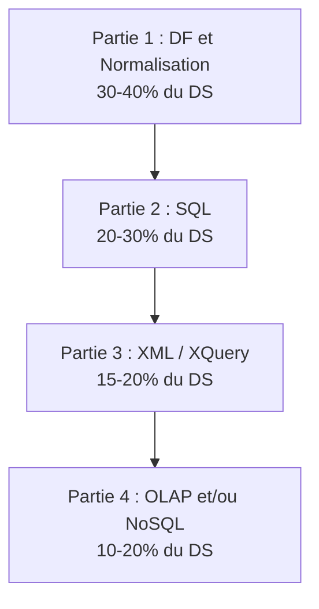

# Preparation au DS -- Bases de Donnees

> Strategie d'examen basee sur l'analyse des annales 2013-2024 (9 annees de sujets).

---

## Structure typique du DS

| Partie | Themes | Poids | Difficulte |
|--------|--------|-------|-----------|
| 1. DF et normalisation | Fermeture, cles candidates, couverture minimale, 3NF, BCNF | **30-40%** | Moyenne-Haute |
| 2. SQL | Jointures, sous-requetes, agregation, division | **20-30%** | Moyenne |
| 3. XML | DTD, XPath, XQuery FLWOR | **15-20%** | Moyenne |
| 4. OLAP / NoSQL | Schema etoile, ROLLUP/CUBE, Cassandra/Neo4j/MongoDB | **10-20%** | Moyenne-Basse |

---

## Strategie pendant l'examen

### Gestion du temps (2h-3h selon les annees)

1. **Lire tout le sujet** en entier (5 min). Identifier les questions faciles.
2. **Commencer par ce qui rapporte le plus** : DF et normalisation (30-40%).
3. **SQL** : ecrire la requete puis la relire en verifiant chaque clause.
4. **XML/XQuery** : la DTD est souvent "offerte" (points faciles).
5. **OLAP/NoSQL** : dernier en general, mais souvent des points faciles.

### Presentation des reponses

- **Fermeture** : montrer chaque iteration sur une ligne separee.
- **Couverture minimale** : indiquer quelle DF on teste et pourquoi on la garde/supprime.
- **SQL** : indenter proprement. Commenter si la requete est complexe.
- **Si la syntaxe exacte echappe** : expliquer en francais ce que la requete devrait faire. Les points partiels existent.

---

## Questions recurrentes par theme

### DF et Normalisation (dans CHAQUE DS)

| Type de question | Frequence | Points typiques |
|-----------------|-----------|----------------|
| Calculer X+ (fermeture) | **Tres haute** | 3-5 pts |
| Trouver les cles candidates | **Tres haute** | 3-5 pts |
| Couverture minimale | Haute | 3-5 pts |
| Decomposition en 3NF (synthese) | Haute | 4-6 pts |
| Decomposition en BCNF | Moyenne | 3-4 pts |
| Identifier la forme normale actuelle | Haute | 2-3 pts |
| Verifier si une DF est impliquee | Moyenne | 2-3 pts |

### SQL

| Type de question | Frequence | Points typiques |
|-----------------|-----------|----------------|
| Jointures (INNER, LEFT) | **Tres haute** | 2-4 pts |
| Sous-requetes (IN, EXISTS) | Haute | 3-4 pts |
| GROUP BY + HAVING | **Tres haute** | 2-4 pts |
| Division (double NOT EXISTS) | Moyenne | 3-5 pts |
| Algebre relationnelle | Moyenne | 2-4 pts |

### XML / XQuery

| Type de question | Frequence |
|-----------------|-----------|
| Ecrire une DTD | Haute |
| Expressions XPath | Haute |
| Requetes XQuery FLWOR | Haute |
| Conversion relationnel-XML | Moyenne |

### OLAP / NoSQL

| Type de question | Frequence |
|-----------------|-----------|
| Schema en etoile | Haute |
| ROLLUP vs CUBE | Moyenne |
| Requete Cassandra CQL | Moyenne |
| Requete Neo4j Cypher | Basse-Moyenne |
| Requete MongoDB | Basse-Moyenne |

---

## Fichiers de preparation detailles

| Fichier | Description |
|---------|-------------|
| [annales-analysis.md](/S6/Bases_de_Donnees/exam-prep/annales-analysis) | Analyse detaillee des sujets 2013-2024 avec exercices types |
| [cheat-sheet-exam.md](/S6/Bases_de_Donnees/exam-prep/cheat-sheet-exam) | Formules, algorithmes, syntaxes a connaitre par coeur |

---

## Check-list de revision

### DF et Normalisation
- [ ] Je sais calculer une fermeture X+ en montrant chaque etape
- [ ] Je sais trouver les cles candidates (attributs jamais a droite + fermeture)
- [ ] Je sais calculer la couverture minimale (decomposer -> reduire -> supprimer)
- [ ] Je sais decomposer en 3NF par synthese (Bernstein)
- [ ] Je sais decomposer en BCNF et identifier la perte de DF

### SQL
- [ ] Je sais ecrire des jointures (INNER, LEFT, CROSS)
- [ ] Je sais utiliser GROUP BY + HAVING correctement
- [ ] Je sais la difference entre WHERE et HAVING
- [ ] Je sais ecrire une division (double NOT EXISTS)
- [ ] Je sais utiliser IN, EXISTS, NOT IN, NOT EXISTS
- [ ] Je sais gerer les NULL (IS NULL, NOT IN danger)

### XML / XQuery
- [ ] Je sais ecrire une DTD avec ID/IDREF
- [ ] Je sais ecrire des expressions XPath (/, //, @, predicats)
- [ ] Je sais ecrire des requetes XQuery FLWOR
- [ ] Je n'oublie pas text() et les accolades { }

### OLAP
- [ ] Je sais dessiner un schema en etoile (faits + dimensions)
- [ ] Je connais la difference ROLLUP vs CUBE
- [ ] Je sais utiliser GROUPING() pour les sous-totaux

### NoSQL
- [ ] Je comprends le theoreme CAP et ACID vs BASE
- [ ] Je sais ecrire une requete CQL (Cassandra) avec partition key
- [ ] Je sais ecrire une requete Cypher (Neo4j) avec MATCH
- [ ] Je sais ecrire un find() et un aggregate() (MongoDB)
- [ ] Je sais quand utiliser SQL vs NoSQL
