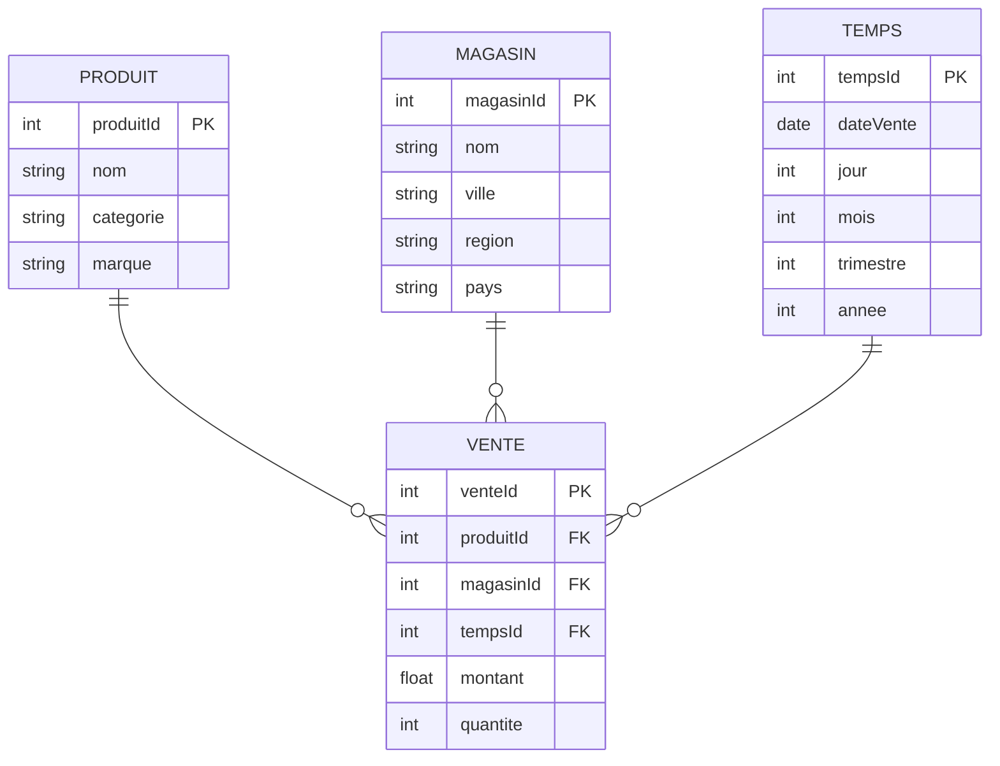

# TD6 -- OLAP et Analyse Multidimensionnelle

> Source : TD6.pdf, Hugo TD 6.pdf
> Schema en etoile, ROLLUP, CUBE, GROUPING SETS, operations sur le cube.

---

## Exercice 1 : Schema en etoile

### Enonce

Concevoir un schema en etoile pour analyser les ventes d'une chaine de magasins.

### Solution



| Element | Identification |
|---------|---------------|
| **Table de faits** | VENTE |
| **Mesures** | montant, quantite |
| **Dimensions** | PRODUIT, MAGASIN, TEMPS |
| **Hierarchies** | TEMPS : jour -> mois -> trimestre -> annee |
| | MAGASIN : magasin -> ville -> region -> pays |
| | PRODUIT : produit -> categorie -> marque |

---

## Exercice 2 : Requetes OLAP

### Q1 : Chiffre d'affaires par region

```sql
SELECT m.region, SUM(v.montant) AS ca
FROM vente v
JOIN magasin m ON v.magasinId = m.magasinId
GROUP BY m.region
ORDER BY ca DESC;
```

### Q2 : CA par region et par trimestre

```sql
SELECT m.region, t.trimestre, t.annee, SUM(v.montant) AS ca
FROM vente v
JOIN magasin m ON v.magasinId = m.magasinId
JOIN temps t ON v.tempsId = t.tempsId
GROUP BY m.region, t.trimestre, t.annee
ORDER BY t.annee, t.trimestre, m.region;
```

### Q3 : ROLLUP -- sous-totaux hierarchiques

```sql
SELECT m.region, m.ville, SUM(v.montant) AS ca
FROM vente v
JOIN magasin m ON v.magasinId = m.magasinId
GROUP BY ROLLUP(m.region, m.ville);
```

**Resultat :**

| region | ville | ca |
|--------|-------|----|
| Bretagne | Rennes | 50000 |
| Bretagne | Brest | 30000 |
| Bretagne | NULL | 80000 |
| IDF | Paris | 120000 |
| IDF | Versailles | 40000 |
| IDF | NULL | 160000 |
| NULL | NULL | 240000 |

**Lecture :** les lignes avec NULL pour ville = sous-total par region. La ligne tout NULL = total general.

### Q4 : CUBE -- toutes les combinaisons

```sql
SELECT m.region, p.categorie, SUM(v.montant) AS ca
FROM vente v
JOIN magasin m ON v.magasinId = m.magasinId
JOIN produit p ON v.produitId = p.produitId
GROUP BY CUBE(m.region, p.categorie);
```

**Lignes supplementaires par rapport a ROLLUP :** les sous-totaux par categorie (region = NULL, categorie = valeur).

### Q5 : GROUPING SETS

```sql
-- Seulement les totaux par region ET les totaux par categorie (pas les deux ensemble)
SELECT m.region, p.categorie, SUM(v.montant) AS ca
FROM vente v
JOIN magasin m ON v.magasinId = m.magasinId
JOIN produit p ON v.produitId = p.produitId
GROUP BY GROUPING SETS (
    (m.region),
    (p.categorie)
);
```

### Q6 : Distinguer vrais NULL des sous-totaux avec GROUPING()

```sql
SELECT
    m.region,
    p.categorie,
    SUM(v.montant) AS ca,
    GROUPING(m.region) AS is_total_region,
    GROUPING(p.categorie) AS is_total_categorie
FROM vente v
JOIN magasin m ON v.magasinId = m.magasinId
JOIN produit p ON v.produitId = p.produitId
GROUP BY CUBE(m.region, p.categorie);
```

- `GROUPING(col) = 0` : valeur reelle
- `GROUPING(col) = 1` : NULL de sous-total

---

## Exercice 3 : Operations sur le cube

### Identification des operations

| Question | Operation | Explication |
|----------|-----------|-------------|
| "CA total par region (au lieu de par ville)" | **Roll-up** | Remonter dans la hierarchie geographique |
| "Detail du CA de Bretagne par ville" | **Drill-down** | Descendre dans la hierarchie |
| "CA en Bretagne uniquement" | **Slice** | Fixer une dimension (region = Bretagne) |
| "CA en Bretagne et IDF, pour 2023 et 2024" | **Dice** | Sous-cube (filtrer plusieurs dimensions) |
| "Intervertir lignes (regions) et colonnes (trimestres)" | **Pivot** | Rotation des axes |

---

## Exercice 4 : ROLLUP vs CUBE

### Enonce : comparer les resultats pour GROUP BY ROLLUP(A, B) et CUBE(A, B)

| Groupement | ROLLUP(A, B) | CUBE(A, B) |
|-----------|---|---|
| (A, B) -- detail complet | Oui | Oui |
| (A) -- sous-total par A | Oui | Oui |
| (B) -- sous-total par B | **Non** | Oui |
| () -- total general | Oui | Oui |
| **Nombre de niveaux** | **n + 1 = 3** | **2^n = 4** |

Generalisation pour 3 dimensions :
- ROLLUP(A, B, C) : 4 niveaux (ABC, AB, A, total)
- CUBE(A, B, C) : 8 niveaux (ABC, AB, AC, BC, A, B, C, total)

---

## Exercice 5 : OLTP vs OLAP

| Critere | OLTP | OLAP |
|---------|------|------|
| Usage | Operations quotidiennes | Analyse et reporting |
| Requetes | INSERT, UPDATE, DELETE | SELECT avec agregations |
| Schema | 3NF (normalise) | Etoile / flocon |
| Utilisateurs | Employes, applications | Managers, analystes |
| Volume par requete | Quelques lignes | Millions de lignes |
| Optimisation | Temps de reponse | Debit de lecture |

---

## Points cles a retenir

- La table de faits est au centre, les dimensions autour.
- ROLLUP respecte l'ordre des colonnes (hierarchique).
- CUBE donne toutes les combinaisons possibles.
- GROUPING() distingue vrais NULL et NULL de sous-total.
- ETL = Extract-Transform-Load pour alimenter l'entrepot.
- Schema etoile = dimensions denormalisees (moins de jointures).
