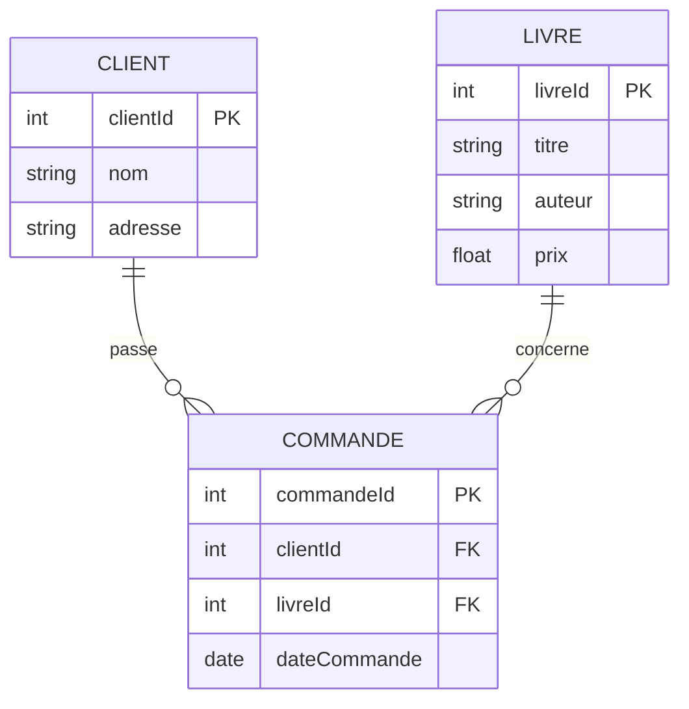
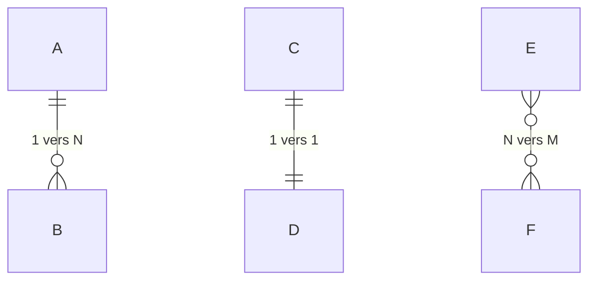

# Chapitre 01 -- Modele Relationnel

> **Idee centrale :** Une base de donnees relationnelle est un ensemble de tableaux lies entre eux par des colonnes communes. Chaque tableau a un role precis, et les liens entre eux garantissent la coherence des donnees.

---

## 1. Pourquoi le modele relationnel ?

### Le probleme : tout dans un seul tableau

| Commande | Client | Adresse | Livre | Auteur | Prix |
|----------|--------|---------|-------|--------|------|
| C001 | Alice | 3 rue A | Harry Potter | Rowling | 15 |
| C002 | Alice | 3 rue A | Le Hobbit | Tolkien | 12 |
| C003 | Bob | 7 rue B | Harry Potter | Rowling | 15 |

**Anomalies :**
- **Redondance** : l'adresse d'Alice est repetee.
- **Mise a jour** : modifier l'adresse d'Alice exige de changer toutes ses lignes.
- **Suppression** : supprimer la commande C003 fait disparaitre Bob.
- **Insertion** : impossible d'ajouter un client sans commande.

### La solution : decomposer en tables



---

## 2. Vocabulaire fondamental

| Terme formel | Equivalent courant | Exemple |
|---|---|---|
| **Relation** | Table | La table "Client" |
| **Attribut** | Colonne | La colonne "nom" |
| **Tuple** | Ligne / enregistrement | (1, "Alice", "3 rue A") |
| **Domaine** | Type de donnees | INTEGER, VARCHAR, DATE |
| **Schema** | Structure de la table | Client(clientId, nom, adresse) |
| **Instance** | Ensemble des tuples actuels | Les 3 clients stockes |
| **Degre** | Nombre d'attributs | Client a degre 3 |
| **Cardinalite** | Nombre de tuples | Client a cardinalite 3 |

**Notation du schema :** La cle primaire est **soulignee** :

```
Client(clientId, nom, adresse)
Commande(commandeId, clientId, livreId, dateCommande)
```

---

## 3. Types de cles

### 3.1 Cle primaire (PK)

Identifie **de facon unique** chaque tuple.

**Regles :**
1. **Unicite** : deux tuples ne partagent jamais la meme valeur de PK.
2. **Non-nullite** : la PK ne peut pas etre NULL.
3. **Minimalite** : on ne peut retirer aucun attribut sans perdre l'unicite.

```sql
CREATE TABLE client (
    clientId INTEGER PRIMARY KEY,
    nom VARCHAR(50) NOT NULL,
    adresse VARCHAR(100)
);
```

### 3.2 Cle etrangere (FK)

Fait reference a la cle primaire d'une autre table. Garantit l'**integrite referentielle**.

```sql
CREATE TABLE commande (
    commandeId INTEGER PRIMARY KEY,
    clientId INTEGER NOT NULL,
    livreId INTEGER NOT NULL,
    dateCommande DATE,
    FOREIGN KEY (clientId) REFERENCES client(clientId),
    FOREIGN KEY (livreId) REFERENCES livre(livreId)
);
```

**Regle :** la valeur de la FK doit exister dans la table referencee (ou etre NULL si autorise).

### 3.3 Cle candidate et super-cle

| Concept | Definition | Exemple |
|---------|-----------|---------|
| **Super-cle** | Tout ensemble d'attributs identifiant uniquement un tuple | {numINE}, {numINE, nom}, {numINE, numINSA} |
| **Cle candidate** | Super-cle **minimale** | {numINE}, {numINSA} |
| **Cle primaire** | Cle candidate **choisie** | {numINE} (par convention) |

---

## 4. Contraintes d'integrite

| Contrainte | Description | SQL |
|---|---|---|
| **NOT NULL** | Valeur obligatoire | `nom VARCHAR(50) NOT NULL` |
| **UNIQUE** | Pas de doublon | `email VARCHAR(100) UNIQUE` |
| **PRIMARY KEY** | Unique + non nul | `clientId INTEGER PRIMARY KEY` |
| **FOREIGN KEY** | Reference valide | `FOREIGN KEY (x) REFERENCES t(x)` |
| **CHECK** | Condition booleenne | `CHECK (prix >= 0)` |
| **DEFAULT** | Valeur par defaut | `statut VARCHAR(10) DEFAULT 'actif'` |

```sql
CREATE TABLE produit (
    produitId INTEGER PRIMARY KEY,
    nom VARCHAR(100) NOT NULL,
    prix REAL CHECK (prix >= 0),
    stock INTEGER DEFAULT 0,
    categorieId INTEGER,
    FOREIGN KEY (categorieId) REFERENCES categorie(categorieId)
);
```

---

## 5. Cardinalites des relations



| Notation | Signification | Exemple |
|----------|---------------|---------|
| `1:1` | Un a un | Personne - Passeport |
| `1:N` | Un a plusieurs | Client - Commandes |
| `N:M` | Plusieurs a plusieurs | Etudiant - Cours (table de jonction) |

**Table de jonction pour N:M :**

```sql
CREATE TABLE inscription (
    etudiantId INTEGER,
    coursId INTEGER,
    note REAL,
    PRIMARY KEY (etudiantId, coursId),
    FOREIGN KEY (etudiantId) REFERENCES etudiant(etudiantId),
    FOREIGN KEY (coursId) REFERENCES cours(coursId)
);
```

---

## 6. Schema de la base du cours (TD/TP)

```sql
CREATE TABLE etudiant (
    etudId VARCHAR(3),
    nom VARCHAR(30),
    prenom VARCHAR(30)
);

CREATE TABLE professeur (
    profId VARCHAR(3),
    nom VARCHAR(30),
    prenom VARCHAR(30)
);

CREATE TABLE enseignement (
    ensId VARCHAR(3),
    sujet VARCHAR(50)
);

CREATE TABLE enseignementSuivi (
    ensId VARCHAR(3),   -- FK vers enseignement
    etudId VARCHAR(3),  -- FK vers etudiant
    profId VARCHAR(3)   -- FK vers professeur
);
```

---

## 7. Pieges classiques

| Piege | Explication |
|-------|-------------|
| Confondre PK et FK | La PK identifie **dans sa propre table**. La FK pointe **vers une autre table**. |
| Oublier l'integrite referentielle | Inserer une FK vers une valeur inexistante provoque une violation. |
| Confondre produit cartesien et jointure | Le produit cartesien combine toutes les lignes (n x m). La jointure filtre. |
| Schema sans PK | Techniquement valide mais interdit l'identification unique et les FK entrantes. |
| NATURAL JOIN imprevisible | Joint sur **toutes** les colonnes de meme nom, ce qui peut inclure des colonnes non souhaitees. |

---

## CHEAT SHEET

```
RELATION  = table (colonnes = attributs, lignes = tuples)
PK        = identifiant unique, non nul, minimal
FK        = reference vers une PK d'une autre table
SUPER-CLE = ensemble d'attributs identifiant un tuple
CLE CANDIDATE = super-cle minimale
INTEGRITE REFERENTIELLE = FK doit pointer vers une valeur existante

Contraintes : NOT NULL | UNIQUE | PK | FK | CHECK | DEFAULT

Cardinalites : 1:1 | 1:N | N:M (table de jonction)

Schema : NomTable(attribut1, attribut2, ...)
         ^ PK souligne
```
