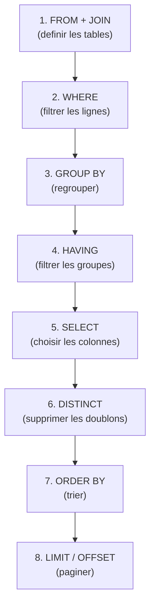
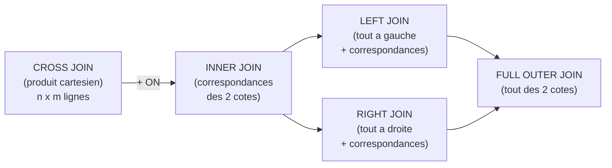

# Chapitre 02 -- SQL Fondamental

> **Idee centrale :** SQL est le langage standard pour interroger les bases de donnees relationnelles. Maitriser SELECT, JOIN, GROUP BY et les sous-requetes couvre 90% des besoins.

---

## 1. Ordre d'execution d'une requete SQL

L'ordre d'**ecriture** est different de l'ordre d'**execution** :



---

## 2. SELECT, FROM, WHERE

### Requete de base

```sql noexec
-- Tous les etudiants
SELECT nom, prenom FROM etudiant;

-- Filtrer avec WHERE
SELECT nom, prenom
FROM etudiant
WHERE nom LIKE '%a%';

-- Plusieurs conditions
SELECT nom, prenom
FROM etudiant
WHERE nom LIKE 'D%' AND prenom IS NOT NULL;
```

### Operateurs de comparaison

| Operateur | Signification | Exemple |
|-----------|---------------|---------|
| `=` | Egal | `WHERE age = 22` |
| `<>` ou `!=` | Different | `WHERE statut <> 'inactif'` |
| `<`, `>`, `<=`, `>=` | Comparaison | `WHERE prix > 10` |
| `BETWEEN` | Intervalle (inclusif) | `WHERE age BETWEEN 18 AND 25` |
| `IN` | Liste de valeurs | `WHERE ville IN ('Rennes', 'Paris')` |
| `LIKE` | Motif textuel | `WHERE nom LIKE 'D%'` |
| `IS NULL` | Test de nullite | `WHERE adresse IS NULL` |
| `IS NOT NULL` | Test de non-nullite | `WHERE email IS NOT NULL` |

### DISTINCT : supprimer les doublons

```sql noexec
-- Villes distinctes des clients
SELECT DISTINCT ville FROM client;
```

---

## 3. JOIN : combiner les tables

### Types de jointures



### INNER JOIN

```sql noexec
-- Clients avec leurs factures (seuls les clients ayant des factures)
SELECT c.name, f.amount
FROM customer c
INNER JOIN facture f ON c.customerId = f.customerId;
```

### LEFT JOIN

```sql noexec
-- Tous les clients, meme sans facture
SELECT c.name, f.amount
FROM customer c
LEFT JOIN facture f ON c.customerId = f.customerId;

-- Clients SANS facture
SELECT c.name
FROM customer c
LEFT JOIN facture f ON c.customerId = f.customerId
WHERE f.factureId IS NULL;
```

### CROSS JOIN (produit cartesien)

```sql noexec
-- Toutes les combinaisons etudiant-professeur
SELECT e.nom, p.nom
FROM etudiant e CROSS JOIN professeur p;
-- 73 etudiants x 25 profs = 1825 lignes
```

### Comparaison

| Type | Lignes retournees | Cas d'usage |
|------|-------------------|-------------|
| INNER JOIN | Correspondances uniquement | Cas standard |
| LEFT JOIN | Tout de gauche + correspondances | "Tous les clients, meme sans commande" |
| RIGHT JOIN | Tout de droite + correspondances | Inverse du LEFT |
| FULL OUTER JOIN | Tout des deux cotes | Union complete |
| CROSS JOIN | Toutes les combinaisons (n x m) | Rarement utile seul |

---

## 4. Sous-requetes

### Sous-requete avec IN

```sql noexec
-- Clients avec au moins une facture > 999 euros
SELECT name
FROM customer
WHERE customerId IN (
    SELECT customerId FROM facture WHERE amount > 999
);
```

### Sous-requete avec EXISTS

```sql noexec
-- Clients avec au moins une facture
SELECT c.name
FROM customer c
WHERE EXISTS (
    SELECT 1 FROM facture f WHERE f.customerId = c.customerId
);
```

### IN vs EXISTS

| Critere | IN | EXISTS |
|---------|-----|--------|
| Utilisation | Liste de valeurs | Test d'existence |
| Sous-requete | S'execute une fois | S'execute pour chaque ligne |
| Performance | Mieux si sous-requete petite | Mieux si table externe petite |
| NULL | Problematique avec NOT IN | Gere correctement les NULL |

### Sous-requete dans FROM

```sql noexec
-- Montant moyen par client, filtre
SELECT sub.name, sub.moyenne
FROM (
    SELECT c.name, AVG(f.amount) AS moyenne
    FROM customer c
    JOIN facture f ON c.customerId = f.customerId
    GROUP BY c.customerId, c.name
) sub
WHERE sub.moyenne > 500;
```

### Sous-requete scalaire

```sql noexec
-- Clients dont le total depasse la moyenne globale
SELECT c.name, SUM(f.amount) AS total
FROM customer c
JOIN facture f ON c.customerId = f.customerId
GROUP BY c.customerId, c.name
HAVING SUM(f.amount) > (SELECT AVG(amount) FROM facture);
```

---

## 5. Agregation et GROUP BY

### Fonctions d'agregation

| Fonction | Description | Exemple |
|----------|-------------|---------|
| `COUNT(*)` | Nombre de lignes | `SELECT COUNT(*) FROM facture` |
| `COUNT(col)` | Valeurs non-NULL | `COUNT(email)` |
| `COUNT(DISTINCT col)` | Valeurs distinctes | `COUNT(DISTINCT ville)` |
| `SUM(col)` | Somme | `SUM(amount)` |
| `AVG(col)` | Moyenne | `AVG(prix)` |
| `MIN(col)` | Minimum | `MIN(dateCommande)` |
| `MAX(col)` | Maximum | `MAX(note)` |

### GROUP BY

```sql noexec
-- Nombre de factures et total par client
SELECT c.name,
       COUNT(*) AS nb_factures,
       SUM(f.amount) AS total,
       AVG(f.amount) AS moyenne
FROM customer c
JOIN facture f ON c.customerId = f.customerId
GROUP BY c.customerId, c.name;
```

### HAVING : filtrer les groupes

```sql noexec
-- Clients avec plus de 5 factures
SELECT c.name, COUNT(*) AS nb
FROM customer c
JOIN facture f ON c.customerId = f.customerId
GROUP BY c.customerId, c.name
HAVING COUNT(*) > 5;
```

### WHERE vs HAVING

```sql noexec
-- WHERE filtre les LIGNES (avant GROUP BY)
-- HAVING filtre les GROUPES (apres GROUP BY)
SELECT customerId, AVG(amount) AS moy
FROM facture
WHERE amount > 0           -- exclure factures a 0 AVANT regroupement
GROUP BY customerId
HAVING AVG(amount) > 500;  -- garder clients avec moyenne > 500
```

---

## 6. ORDER BY et LIMIT

```sql noexec
-- Trier par montant decroissant, limiter a 10 resultats
SELECT name, total
FROM vue_clients_totaux
ORDER BY total DESC
LIMIT 10;

-- Pagination : page 2 (lignes 11-20)
SELECT * FROM facture
ORDER BY factureId
LIMIT 10 OFFSET 10;
```

---

## 7. Operations ensemblistes

| Operation | SQL | Description |
|-----------|-----|-------------|
| Union | `UNION` | Lignes de A **ou** B (sans doublons) |
| Union totale | `UNION ALL` | Lignes de A **ou** B (avec doublons) |
| Intersection | `INTERSECT` | Lignes de A **et** B |
| Difference | `EXCEPT` | Lignes de A **pas dans** B |

```sql noexec
-- Etudiants en maths OU physique
SELECT etudId FROM inscription_maths
UNION
SELECT etudId FROM inscription_physique;

-- Etudiants en maths ET physique
SELECT etudId FROM inscription_maths
INTERSECT
SELECT etudId FROM inscription_physique;

-- Etudiants en maths mais PAS en physique
SELECT etudId FROM inscription_maths
EXCEPT
SELECT etudId FROM inscription_physique;
```

**Condition :** les deux requetes doivent avoir le **meme nombre de colonnes** et des **types compatibles**.

---

## 8. Division relationnelle en SQL

"Trouver les X en relation avec **TOUS** les Y."

### Methode 1 : double NOT EXISTS

```sql noexec
-- Etudiants inscrits a TOUS les cours
SELECT e.nom
FROM etudiant e
WHERE NOT EXISTS (
    SELECT ens.ensId
    FROM enseignement ens
    WHERE NOT EXISTS (
        SELECT *
        FROM enseignementSuivi es
        WHERE es.etudId = e.etudId
          AND es.ensId = ens.ensId
    )
);
```

**Lecture :** "Les etudiants pour lesquels il n'existe PAS de cours auquel ils ne sont PAS inscrits."

### Methode 2 : comptage

```sql noexec
-- Etudiants inscrits a TOUS les cours (par comptage)
SELECT e.nom
FROM etudiant e
JOIN enseignementSuivi es ON e.etudId = es.etudId
GROUP BY e.etudId, e.nom
HAVING COUNT(DISTINCT es.ensId) = (SELECT COUNT(*) FROM enseignement);
```

---

## 9. Pieges classiques

| Piege | Pourquoi | Correction |
|-------|----------|------------|
| `WHERE col = NULL` | NULL n'est egal a rien | `WHERE col IS NULL` |
| `NOT IN` avec NULL | Resultat vide si un NULL dans la sous-requete | Ajouter `WHERE col IS NOT NULL` |
| SELECT col sans GROUP BY | En SQL standard, colonne non agregee doit etre dans GROUP BY | Ajouter au GROUP BY |
| HAVING pour filtrer des lignes | HAVING filtre des groupes | Utiliser WHERE |
| Oublier DISTINCT | Doublons si jointure produit des lignes multiples | Ajouter DISTINCT |
| NATURAL JOIN | Joint sur toutes colonnes de meme nom | Preferer JOIN ... ON |

---

## CHEAT SHEET

```
SELECT [DISTINCT] col1, col2, AGG(col3)
FROM table1
[INNER|LEFT|RIGHT|FULL OUTER|CROSS] JOIN table2 ON condition
WHERE condition_lignes
GROUP BY col1, col2
HAVING condition_groupes
ORDER BY col1 [ASC|DESC]
LIMIT n OFFSET m;

SOUS-REQUETES :
  WHERE col IN (SELECT ...)          -- liste de valeurs
  WHERE EXISTS (SELECT ...)          -- test d'existence
  FROM (SELECT ...) AS alias         -- table derivee
  HAVING AGG(col) > (SELECT ...)     -- scalaire

ENSEMBLES :
  UNION | UNION ALL | INTERSECT | EXCEPT

DIVISION (double NOT EXISTS) :
  SELECT x FROM T1
  WHERE NOT EXISTS (
    SELECT y FROM T2
    WHERE NOT EXISTS (
      SELECT * FROM T3
      WHERE T3.x = T1.x AND T3.y = T2.y))

ORDRE D'EXECUTION :
  FROM -> WHERE -> GROUP BY -> HAVING -> SELECT -> DISTINCT -> ORDER BY -> LIMIT
```
