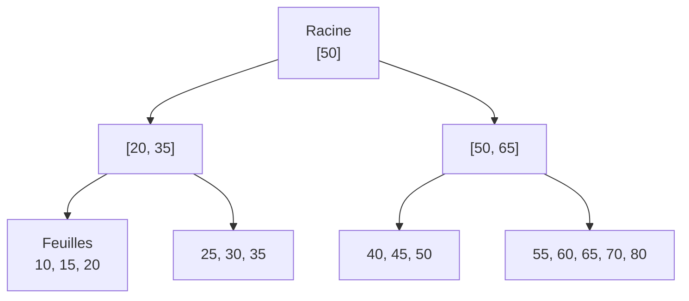
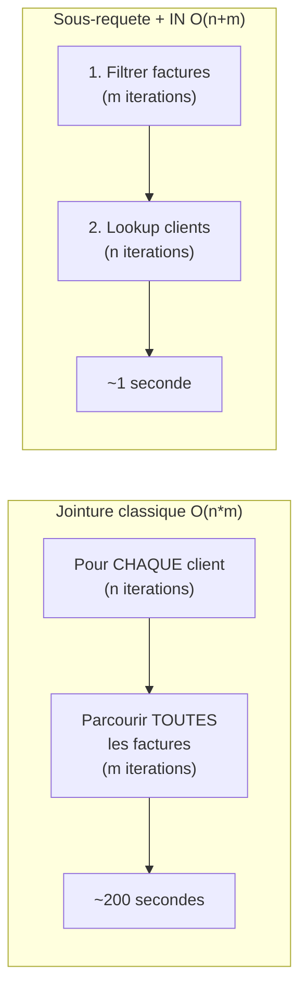

# Chapitre 04 -- Optimisation de Requetes

> **Idee centrale :** La performance d'une requete depend autant de **comment** on l'ecrit que de **ce qu'on demande**. Un index bien place ou une requete restructuree peut accelerer un facteur 1000x.

---

## 1. Plans d'execution

### EXPLAIN QUERY PLAN

```sql noexec
-- Voir comment le SGBD execute une requete
EXPLAIN QUERY PLAN
SELECT c.name
FROM customer c
JOIN facture f ON c.customerId = f.customerId
WHERE f.amount > 999;
```

### Lecture du plan d'execution

| Terme | Signification | Performance |
|---|---|---|
| `SCAN TABLE` | Parcours complet de la table | O(n) -- lent |
| `SEARCH TABLE ... USING INDEX` | Recherche via un index | O(log n) -- rapide |
| `COVERING INDEX` | Toutes les colonnes dans l'index | Optimal (pas d'acces table) |
| `USING TEMPORARY B-TREE` | Tri temporaire (ORDER BY, DISTINCT) | Cout supplementaire |
| `USE TEMP B-TREE FOR ORDER BY` | Tri non couvert par index | Possible optimisation |

```
Avant index : SCAN TABLE demo           -> O(n)    parcours lineaire
Apres index : SEARCH TABLE USING INDEX  -> O(log n) recherche arborescente
```

---

## 2. Types d'index

### 2.1 Index B-tree (B+ tree)

Le type d'index le plus courant. Structure arborescente equilibree.



**Caracteristiques :**
- Efficace pour : egalite (`=`), intervalles (`>`, `<`, `BETWEEN`), tri (`ORDER BY`)
- Complexite de recherche : O(log n)
- Type par defaut dans SQLite, PostgreSQL, MySQL

```sql noexec
-- Creer un index B-tree
CREATE INDEX idx_code ON demo(code);

-- Verifier l'utilisation
EXPLAIN QUERY PLAN SELECT * FROM demo WHERE code = 62518937;
-- Resultat : SEARCH TABLE demo USING INDEX idx_code (code=?)
```

### 2.2 Index Hash

Table de hachage : acces direct par cle.

**Caracteristiques :**
- Efficace pour : egalite (`=`) uniquement
- Complexite : O(1) en moyenne
- **Ne supporte PAS** les intervalles, le tri, les requetes de type `>`, `<`, `BETWEEN`
- Disponible dans PostgreSQL, MySQL (Memory engine)

```sql noexec
-- PostgreSQL
CREATE INDEX idx_hash_code ON demo USING HASH (code);
```

### Comparaison B-tree vs Hash

| Critere | B-tree | Hash |
|---------|--------|------|
| Egalite (`=`) | O(log n) | O(1) |
| Intervalle (`>`, `<`, `BETWEEN`) | O(log n + k) | Non supporte |
| Tri (`ORDER BY`) | Supporte | Non supporte |
| Prefixe (`LIKE 'abc%'`) | Supporte | Non supporte |
| Espace | Modere | Faible |
| Cas d'usage | General | Recherche exacte uniquement |

### 2.3 Index composite (multi-colonnes)

```sql noexec
-- Index sur plusieurs colonnes
CREATE INDEX idx_composite ON facture(customerId, amount);

-- Cet index est utile pour :
-- 1. WHERE customerId = ?                    (utilise la 1ere colonne)
-- 2. WHERE customerId = ? AND amount > ?     (utilise les 2 colonnes)
-- 3. ORDER BY customerId, amount             (utilise les 2 colonnes)

-- Cet index est INUTILE pour :
-- WHERE amount > ?                           (la 1ere colonne n'est pas filtree)
```

**Regle du prefixe gauche :** un index composite (A, B, C) est utilisable pour les filtres sur (A), (A, B), ou (A, B, C), mais PAS pour (B), (C), ou (B, C) seul.

---

## 3. Impact des index -- resultats du TP1

### Sur une table de 1 million de lignes

| Requete | Sans index | Avec index | Acceleration |
|---------|-----------|------------|-------------|
| Egalite (valeur existante) | 0.1-0.2s | 0.0001s | **1000x** |
| Egalite (valeur inexistante) | 0.05-0.08s | 0.0001s | **800x** |
| Intervalle (`>`) | 5-7s | 0.0004s | **15000x** |

### Quand creer un index

| Situation | Index recommande |
|-----------|-----------------|
| Colonne dans `WHERE` avec `=` | Index simple |
| Colonne dans `JOIN ... ON` | Index simple |
| Colonnes dans `WHERE` avec `=` et `>` | Index composite (`=` d'abord, `>` ensuite) |
| Colonne dans `ORDER BY` | Index simple |
| Petite table (< 1000 lignes) | Pas necessaire |
| Colonne tres souvent modifiee | Attention au cout de maintenance |
| Table frequemment inseree en masse | Creer l'index apres les insertions |

---

## 4. Strategies d'evaluation des requetes

### Comparaison du TP1 : trouver les clients avec factures > 999 euros



| Approche | Temps sans index | Temps avec index | Complexite |
|----------|-----------------|-----------------|------------|
| JOIN + WHERE | 200s | 3s | O(n*m) |
| **Sous-requete + IN** | **1s** | **0.8s** | **O(n+m)** |
| NATURAL JOIN | 283s | 4.5s | O(n*m) + surcout |
| Sous-requete avec JOIN interne | 219s | 5.3s | O(n*m) |

```sql noexec
-- MEILLEURE APPROCHE : sous-requete avec IN
SELECT name
FROM customer
WHERE customerId IN (
    SELECT f.customerId FROM facture f WHERE amount > 999
);

-- APPROCHE LENTE : jointure classique
SELECT c.name
FROM customer c, facture f
WHERE f.customerId = c.customerId AND f.amount > 999;
```

**Pourquoi la sous-requete gagne :** la sous-requete filtre d'abord les factures (1 seul parcours), puis le IN fait un test d'appartenance efficace. Le JOIN classique fait un produit cartesien filtre, soit n * m operations.

---

## 5. Algorithmes de jointure

| Algorithme | Complexite | Description |
|------------|-----------|-------------|
| **Nested Loop** | O(n * m) | Pour chaque ligne de A, parcourir B. Simple mais lent. |
| **Hash Join** | O(n + m) | Construire une table de hachage sur la petite table, puis parcourir la grande. |
| **Sort-Merge Join** | O(n log n + m log m) | Trier les deux tables, puis fusionner. Efficace si les tables sont deja triees. |
| **Index Nested Loop** | O(n * log m) | Comme Nested Loop mais utilise un index sur B. |

---

## 6. Regles d'optimisation

### Heuristiques du SGBD

1. **Pousser les selections** : appliquer les filtres le plus tot possible pour reduire la taille des resultats intermediaires.
2. **Pousser les projections** : ne garder que les colonnes necessaires.
3. **Reordonner les jointures** : commencer par les tables les plus petites ou les plus selectivement filtrees.
4. **Utiliser les index** : preferer un SEARCH a un SCAN quand un index est disponible.

### Bonnes pratiques

```sql noexec
-- BON : filtrer avant de joindre
SELECT c.name
FROM customer c
WHERE c.customerId IN (
    SELECT customerId FROM facture WHERE amount > 999
);

-- MAUVAIS : joindre puis filtrer
SELECT c.name
FROM customer c, facture f
WHERE c.customerId = f.customerId AND f.amount > 999;

-- BON : selectionner seulement les colonnes necessaires
SELECT name FROM customer WHERE customerId = 42;

-- MAUVAIS : selectionner tout
SELECT * FROM customer WHERE customerId = 42;
```

---

## 7. Transactions et performance

```sql noexec
-- LENT : un commit par insertion
INSERT INTO demo VALUES (1, 'a');
INSERT INTO demo VALUES (2, 'b');
INSERT INTO demo VALUES (3, 'c');
-- Chaque INSERT fait un fsync sur le disque

-- RAPIDE : un seul commit pour tout
BEGIN TRANSACTION;
INSERT INTO demo VALUES (1, 'a');
INSERT INTO demo VALUES (2, 'b');
INSERT INTO demo VALUES (3, 'c');
COMMIT;
-- Un seul fsync pour les 3 insertions
```

---

## 8. Pieges classiques

| Piege | Explication |
|-------|-------------|
| Index sur petite table | Inutile car le SCAN est aussi rapide que le SEARCH |
| Trop d'index | Chaque INSERT/UPDATE/DELETE doit mettre a jour tous les index |
| Index sur colonne peu selective | Un index sur "sexe" (M/F) n'est pas utile car il ne filtre que 50% |
| Oublier EXPLAIN | Toujours verifier que l'index est utilise |
| LIKE '%abc' | Le `%` en debut empeche l'utilisation de l'index B-tree |
| Fonctions sur colonne indexee | `WHERE UPPER(nom) = 'ALICE'` ne peut pas utiliser l'index sur nom |

---

## CHEAT SHEET

```
INDEX B-TREE (defaut) :
  CREATE INDEX idx ON table(col);
  Supporte : =, <, >, <=, >=, BETWEEN, ORDER BY, LIKE 'prefix%'
  Complexite : O(log n)

INDEX HASH :
  CREATE INDEX idx ON table USING HASH (col);  -- PostgreSQL
  Supporte : = uniquement
  Complexite : O(1)

INDEX COMPOSITE :
  CREATE INDEX idx ON table(col1, col2);
  Regle du prefixe gauche : (col1), (col1, col2) OK | (col2) seul NON

ANALYSE :
  EXPLAIN QUERY PLAN SELECT ...;
  SCAN = parcours complet O(n)     -> MAUVAIS
  SEARCH USING INDEX = O(log n)    -> BON

PERFORMANCE COMPAREE (1M lignes) :
  Sous-requete + IN : ~1s   (O(n+m))
  JOIN classique    : ~200s (O(n*m))
  Index B-tree      : 800x a 15000x plus rapide

REGLES :
  1. Filtrer AVANT de joindre
  2. Indexer les colonnes dans WHERE et JOIN ON
  3. Eviter SELECT *
  4. Utiliser des transactions pour les insertions en masse
  5. Verifier avec EXPLAIN QUERY PLAN
```
