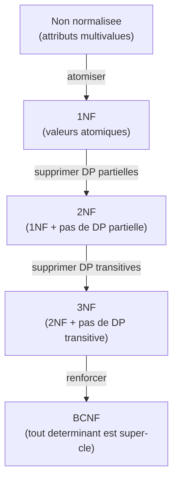

# Chapitre 05 -- Normalisation

> **Idee centrale :** La normalisation consiste a structurer les tables pour eliminer les redondances et les anomalies. Les dependances fonctionnelles sont l'outil mathematique qui guide ce processus.

---

## 1. Dependances fonctionnelles (DF)

### Definition

Une **dependance fonctionnelle** `X -> Y` signifie : si deux tuples ont les **memes valeurs** sur X, ils ont **forcement les memes valeurs** sur Y.

**Notation :** `X -> Y` se lit "X determine fonctionnellement Y".

| DF | Explication | Vraie ? |
|---|---|---|
| `numEtudiant -> nom, prenom` | Un numero determine le nom | Oui |
| `nom, prenom -> numEtudiant` | Un nom determine le numero | Non (homonymes) |
| `codePostal -> ville` | Un CP determine la ville | Oui |
| `ville -> codePostal` | Une ville determine le CP | Non (Paris a 20 CP) |
| `ISBN -> titre, auteur` | Un ISBN determine le livre | Oui |

**Attention :** une DF n'est PAS symetrique. `A -> B` n'implique pas `B -> A`.

---

## 2. Axiomes d'Armstrong

Trois regles logiques pour deduire de nouvelles DF.

| Axiome | Formulation | Exemple |
|--------|-------------|---------|
| **Reflexivite** | Si Y est dans X, alors X -> Y | {nom, prenom} -> {nom} |
| **Augmentation** | Si X -> Y, alors XZ -> YZ | Si A -> B, alors AC -> BC |
| **Transitivite** | Si X -> Y et Y -> Z, alors X -> Z | Si A -> B et B -> C, alors A -> C |

### Regles derivees

| Regle | Formulation | Usage |
|-------|-------------|-------|
| **Union** | Si X -> Y et X -> Z, alors X -> YZ | Combiner les parties droites |
| **Decomposition** | Si X -> YZ, alors X -> Y et X -> Z | Separer les parties droites |
| **Pseudo-transitivite** | Si X -> Y et WY -> Z, alors WX -> Z | Combinaison |

---

## 3. Fermeture d'un ensemble d'attributs (X+)

### Algorithme

```
Entree : ensemble d'attributs X, ensemble de DF F
Sortie : X+ (tous les attributs determinables depuis X)

1. resultat = X
2. Repeter :
     Pour chaque DF (A -> B) dans F :
       Si A est inclus dans resultat :
         resultat = resultat U B
3. Jusqu'a stabilite
4. Retourner resultat
```

### Exemple detaille

R(A, B, C, D, E), F = { A -> B, B -> C, A -> D, D -> E }

| Etape | Resultat | DF appliquee | Ajout |
|-------|----------|-------------|-------|
| Init | {A} | -- | -- |
| 1 | {A} | A -> B | B |
| 2 | {A, B} | B -> C | C |
| 3 | {A, B, C} | A -> D | D |
| 4 | {A, B, C, D} | D -> E | E |
| 5 | {A, B, C, D, E} | -- | stable |

**Resultat :** {A}+ = {A, B, C, D, E} = tous les attributs, donc A est une **cle candidate**.

### Utilite de la fermeture

1. **Verifier si X -> Y est impliquee** : Y est dans X+ ?
2. **Trouver les cles candidates** : X+ contient tous les attributs ?
3. **Calculer la couverture minimale.**

---

## 4. Trouver les cles candidates

### Methode systematique

```
1. Identifier les attributs JAMAIS en partie droite d'une DF
   -> Ils DOIVENT etre dans toute cle.
2. Calculer la fermeture de ces attributs.
3. Si fermeture = tous les attributs -> c'est la cle.
4. Sinon, ajouter progressivement des attributs et recalculer.
```

### Exemple

R(A, B, C, D), F = { A -> B, C -> D }

- Attributs jamais en partie droite : A et C
- {A, C}+ : A -> B donne {A, B, C}, puis C -> D donne {A, B, C, D} -- tous les attributs
- A seul : {A}+ = {A, B} -- pas une super-cle
- C seul : {C}+ = {C, D} -- pas une super-cle
- **Cle candidate : {A, C}**

---

## 5. Couverture minimale (couverture canonique)

### Algorithme

```
1. DECOMPOSER : un seul attribut en partie droite
   A -> BC  devient  A -> B  et  A -> C

2. REDUIRE les parties gauches :
   Pour chaque DF X -> A, tester si un sous-ensemble de X suffit.
   Si AB -> C mais {B}+ contient C, remplacer par B -> C.

3. SUPPRIMER les DF redondantes :
   Pour chaque DF X -> A, tester si elle est deductible des autres.
   Si A -> C est deductible de A -> B et B -> C, la supprimer.
```

### Exemple

F = { A -> BC, B -> C, AB -> D }

**Etape 1 :** A -> B, A -> C, B -> C, AB -> D

**Etape 2 :** AB -> D : A seul ? {A}+ = {A, B, C}. Pas D. B seul ? {B}+ = {B, C}. Pas D. AB reste.

**Etape 3 :** A -> C : sans cette DF, A -> B et B -> C donnent A -> C par transitivite. Redondante, supprimer.

**Fmin = { A -> B, B -> C, AB -> D }**

---

## 6. Formes normales

### Hierarchie



### 6.1 Premiere forme normale (1NF)

**Regle :** tous les attributs contiennent des valeurs **atomiques** (indivisibles).

| Interdit | Autorise |
|----------|---------|
| `cours = {Maths, Info, Physique}` | Une ligne par cours |

```
NON 1NF :  (E1, Alice, {Maths, Info})
1NF :      (E1, Alice, Maths)
           (E1, Alice, Info)
```

### 6.2 Deuxieme forme normale (2NF)

**Regle :** 1NF + aucun attribut non-cle ne depend d'une **partie** de la cle (pas de DP partielle).

Pertinent seulement si la cle est **composee**.

```
NON 2NF : Inscription(etudiantId, coursId, nomEtudiant, note)
  DF : etudiantId -> nomEtudiant   (DP partielle !)

2NF :
  Etudiant(etudiantId, nomEtudiant)
  Inscription(etudiantId, coursId, note)
```

### 6.3 Troisieme forme normale (3NF)

**Regle :** 2NF + aucun attribut non-cle ne depend **transitivement** de la cle.

Pour toute DF non triviale X -> A (A pas dans X) :
- Soit X est une super-cle,
- Soit A est un **attribut premier** (fait partie d'une cle candidate).

```
NON 3NF : Employe(employeId, nom, deptId, nomDept)
  DF : deptId -> nomDept   (DP transitive via employeId -> deptId -> nomDept)

3NF :
  Employe(employeId, nom, deptId)
  Departement(deptId, nomDept)
```

### 6.4 Forme normale de Boyce-Codd (BCNF)

**Regle :** pour toute DF non triviale X -> Y, X est une **super-cle** (point final).

Plus strict que la 3NF : pas d'exception pour les attributs premiers.

| Forme | Condition sur X -> A |
|-------|---------------------|
| 3NF | X super-cle **OU** A attribut premier |
| BCNF | X super-cle (c'est tout) |

### Recapitulatif des formes normales

| Forme | Condition | Elimine |
|-------|-----------|---------|
| **1NF** | Valeurs atomiques | Attributs multivalues |
| **2NF** | 1NF + pas de DP partielle | Dependances d'un sous-ensemble de la cle |
| **3NF** | 2NF + pas de DP transitive | Dependances entre attributs non-cles |
| **BCNF** | Tout determinant est super-cle | Toute anomalie liee aux DF |

---

## 7. Algorithme de decomposition en 3NF (synthese de Bernstein)

```
1. Calculer la couverture minimale Fmin
2. Pour chaque partie gauche X distincte dans Fmin :
   Creer R_X = X U {tous les A tels que X -> A dans Fmin}
   Cle de R_X = X
3. Si aucune relation ne contient une cle candidate de R :
   Ajouter une relation avec une cle candidate
4. Supprimer les relations incluses dans d'autres
```

### Exemple

R(A, B, C, D, E), F = { AB -> C, C -> D, D -> E, E -> A }

Fmin = { AB -> C, C -> D, D -> E, E -> A }

| Partie gauche | Relation |
|---|---|
| AB | R1(**A**, **B**, C) |
| C | R2(**C**, D) |
| D | R3(**D**, E) |
| E | R4(**E**, A) |

{AB}+ = {A, B, C, D, E}. R1 contient AB. Pas besoin d'ajouter une relation.

**Resultat :** R1(A, B, C), R2(C, D), R3(D, E), R4(E, A)

---

## 8. Algorithme de decomposition en BCNF

```
1. Si R est en BCNF, retourner {R}
2. Trouver X -> Y qui viole BCNF (X pas super-cle)
3. Calculer X+
4. Decomposer en :
   R1 = X+
   R2 = X U (attributs de R - X+)
5. Appliquer recursivement sur R1 et R2
```

### Proprietes comparees

| Propriete | 3NF (synthese) | BCNF (decomposition) |
|---|---|---|
| Sans perte de jointure | Oui | Oui |
| Preservation des DF | **Oui** | Pas toujours |
| Existence garantie | Toujours | Toujours |

---

## 9. Pieges classiques

| Piege | Explication |
|-------|-------------|
| Confondre DP partielle et DP transitive | Partielle : depend d'une *partie* de la cle. Transitive : depend d'un attribut non-cle via un autre. |
| Croire 3NF = BCNF | 3NF tolere l'exception pour les attributs premiers. |
| Oublier d'ajouter la cle (etape 3 de la synthese) | Si aucune relation ne contient une cle candidate, il faut en ajouter une. |
| Mauvais ordre de la couverture minimale | Decomposer -> Reduire -> Supprimer. Pas l'inverse. |
| Arreter la fermeture trop tot | Iterer jusqu'a stabilite. Chaque nouvel attribut peut debloquer d'autres DF. |
| Confondre "attribut premier" et "cle primaire" | Attribut premier = fait partie d'au moins une cle candidate. |

---

## CHEAT SHEET

```
DF : X -> Y  (si meme X, alors meme Y)

ARMSTRONG :
  Reflexivite  : Y dans X => X -> Y
  Augmentation : X -> Y => XZ -> YZ
  Transitivite : X -> Y, Y -> Z => X -> Z

FERMETURE X+ :
  resultat = X
  Repeter : si A -> B et A dans resultat, ajouter B
  Jusqu'a stabilite

CLE CANDIDATE :
  1. Attributs jamais en partie droite = obligatoires
  2. Calculer fermeture
  3. Si = tous les attributs -> cle candidate

COUVERTURE MINIMALE :
  1. Decomposer (1 attribut a droite)
  2. Reduire parties gauches
  3. Supprimer DF redondantes

FORMES NORMALES :
  1NF : valeurs atomiques
  2NF : 1NF + pas de DP partielle
  3NF : 2NF + pas de DP transitive
  BCNF : tout determinant est super-cle

DECOMPOSITION 3NF (synthese) :
  1. Couverture minimale
  2. Une relation par partie gauche
  3. Ajouter cle si necessaire
  4. Supprimer relations incluses

DECOMPOSITION BCNF :
  1. Trouver X -> Y violant BCNF
  2. R1 = X+, R2 = X U (R - X+)
  3. Recursion
```
