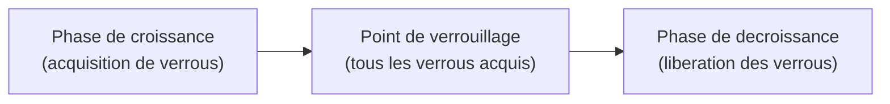
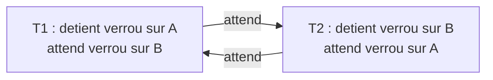
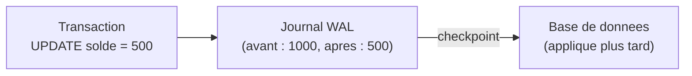

# Chapitre 06 -- Transactions et Concurrence

> **Idee centrale :** Les transactions garantissent que les operations sur la base restent coherentes, meme en cas de panne ou d'acces simultanes. ACID est le contrat fondamental du modele relationnel.

---

## 1. Qu'est-ce qu'une transaction ?

Une transaction est un **ensemble d'operations** considere comme une **unite indivisible**. Soit toutes les operations reussissent, soit aucune n'est appliquee.

```sql
-- Transfert bancaire : debiter Alice, crediter Bob
BEGIN TRANSACTION;
  UPDATE compte SET solde = solde - 100 WHERE nom = 'Alice';
  UPDATE compte SET solde = solde + 100 WHERE nom = 'Bob';
COMMIT;

-- Si une erreur survient entre les deux UPDATE :
ROLLBACK;  -- annule tout : Alice et Bob gardent leurs soldes initiaux
```

---

## 2. Proprietes ACID

| Propriete | Signification | Garantie |
|-----------|---------------|----------|
| **Atomicite** | Tout ou rien | Si une operation echoue, toutes sont annulees |
| **Coherence** | Etat valide | La base passe d'un etat coherent a un autre |
| **Isolation** | Independance | Les transactions concurrentes ne se perturbent pas |
| **Durabilite** | Persistance | Les modifications commitees survivent aux pannes |

### Analogie

| ACID | Analogie bancaire |
|------|-------------------|
| Atomicite | Un virement est soit complet, soit annule |
| Coherence | Le total des comptes reste constant |
| Isolation | Deux virements simultanes ne se melangent pas |
| Durabilite | Un virement confirme reste enregistre meme si la banque ferme |

---

## 3. Problemes de concurrence

Quand plusieurs transactions s'executent en parallele, plusieurs anomalies peuvent survenir :

### 3.1 Lecture sale (Dirty Read)

T1 lit des donnees modifiees par T2, mais T2 fait un ROLLBACK. T1 a lu des donnees qui n'ont jamais existe.

```
T1: READ(solde_Alice)          -> 1000
T2: UPDATE solde_Alice = 500   (pas encore COMMIT)
T1: READ(solde_Alice)          -> 500  (lecture sale !)
T2: ROLLBACK                   -> solde revient a 1000
T1 a utilise 500 qui n'a jamais ete valide
```

### 3.2 Lecture non repetable (Non-Repeatable Read)

T1 lit deux fois la meme donnee et obtient des valeurs differentes car T2 a modifie entre-temps.

```
T1: READ(solde_Alice)          -> 1000
T2: UPDATE solde_Alice = 500
T2: COMMIT
T1: READ(solde_Alice)          -> 500  (different de la 1ere lecture !)
```

### 3.3 Lecture fantome (Phantom Read)

T1 execute deux fois la meme requete et obtient des lignes differentes car T2 a insere/supprime entre-temps.

```
T1: SELECT COUNT(*) FROM compte WHERE solde > 500  -> 10
T2: INSERT INTO compte VALUES ('Charlie', 800)
T2: COMMIT
T1: SELECT COUNT(*) FROM compte WHERE solde > 500  -> 11  (fantome !)
```

---

## 4. Niveaux d'isolation

| Niveau | Dirty Read | Non-Repeatable Read | Phantom Read |
|--------|-----------|--------------------|--------------| 
| **READ UNCOMMITTED** | Possible | Possible | Possible |
| **READ COMMITTED** | Empeche | Possible | Possible |
| **REPEATABLE READ** | Empeche | Empeche | Possible |
| **SERIALIZABLE** | Empeche | Empeche | Empeche |

```sql
-- Definir le niveau d'isolation
SET TRANSACTION ISOLATION LEVEL SERIALIZABLE;

-- PostgreSQL : par defaut READ COMMITTED
-- MySQL : par defaut REPEATABLE READ
-- SQLite : par defaut SERIALIZABLE (un seul ecrivain a la fois)
```

### Compromis

| Niveau | Protection | Performance |
|--------|-----------|------------|
| READ UNCOMMITTED | Minimale | Maximale |
| READ COMMITTED | Bonne | Bonne |
| REPEATABLE READ | Tres bonne | Moderee |
| SERIALIZABLE | Totale | Minimale (verrouillage intensif) |

---

## 5. Mecanismes de controle de concurrence

### 5.1 Verrous (Locks)

| Type | Description | Compatibilite |
|------|-------------|--------------|
| **Verrou partage (S)** | Lecture autorisee, ecriture bloquee | Plusieurs S simultanement |
| **Verrou exclusif (X)** | Lecture et ecriture bloquees pour les autres | Un seul X a la fois |

**Matrice de compatibilite :**

|  | S (existant) | X (existant) |
|--|---|---|
| S (demande) | OK | Bloque |
| X (demande) | Bloque | Bloque |

### Protocole de verrouillage a deux phases (2PL)



**Regles :**
1. **Phase de croissance** : la transaction peut acquerir des verrous mais pas en liberer.
2. **Phase de decroissance** : la transaction peut liberer des verrous mais pas en acquerir.
3. Garantit la **serialisabilite** des transactions.

### 5.2 Deadlocks (interblocages)



**Solutions :**
- **Detection** : graphe d'attente, cycle = deadlock. Tuer une des transactions (la victime).
- **Prevention** : ordonner les ressources (toujours verrouiller A avant B).
- **Timeout** : annuler une transaction qui attend trop longtemps.

---

## 6. WAL (Write-Ahead Logging)

### Principe

Avant d'ecrire une modification sur le disque, on **ecrit d'abord dans un journal** (log). Cela garantit la durabilite et permet la recuperation apres panne.



### Contenu du journal

Chaque entree contient :
- **Transaction ID**
- **Avant-image** (ancienne valeur)
- **Apres-image** (nouvelle valeur)
- **Type** : BEGIN, WRITE, COMMIT, ABORT

### Recuperation apres panne

| Cas | Action |
|-----|--------|
| Transaction commitee mais pas ecrite sur disque | **REDO** : rejouer les ecritures depuis le journal |
| Transaction non commitee | **UNDO** : restaurer les avant-images |

### Algorithme ARIES (simplifie)

```
1. ANALYSE : parcourir le journal depuis le dernier checkpoint
   pour identifier les transactions actives au moment de la panne.
2. REDO : rejouer toutes les ecritures (commitees ou non)
   pour restaurer l'etat exact au moment de la panne.
3. UNDO : annuler les ecritures des transactions non commitees
   en restaurant les avant-images.
```

---

## 7. ACID vs BASE (NoSQL)

| Propriete | ACID (SQL) | BASE (NoSQL) |
|-----------|-----------|-------------|
| **A** | Atomicity | **B**asically **A**vailable |
| **C** | Consistency | **S**oft state |
| **I** | Isolation | **E**ventually consistent |
| **D** | Durability | -- |

- **ACID** : coherence forte, transactions strictes. Adapte aux donnees critiques (bancaire, medical).
- **BASE** : coherence eventuelle, disponibilite privilegiee. Adapte aux donnees massives avec tolerance aux incoherences temporaires.

---

## 8. Pieges classiques

| Piege | Explication |
|-------|-------------|
| Oublier COMMIT | Les modifications restent dans un etat transitoire |
| Transaction trop longue | Verrouille les ressources et bloque les autres transactions |
| Deadlock non gere | L'application se bloque indefiniment |
| Niveau d'isolation trop bas | Lectures sales ou non repetables |
| Niveau d'isolation trop haut | Performance degradee, risque accru de deadlocks |
| Confondre ROLLBACK et crash | ROLLBACK est volontaire; un crash necessite une recuperation WAL |

---

## CHEAT SHEET

```
TRANSACTION :
  BEGIN TRANSACTION;
  ... operations ...
  COMMIT;       -- valider
  ROLLBACK;     -- annuler

ACID :
  Atomicite   : tout ou rien
  Coherence   : etat valide -> etat valide
  Isolation   : transactions independantes
  Durabilite  : COMMIT = permanent

PROBLEMES DE CONCURRENCE :
  Dirty Read         : lire des donnees non commitees
  Non-Repeatable Read: relire donne un resultat different
  Phantom Read       : relire donne des lignes differentes

NIVEAUX D'ISOLATION :
  READ UNCOMMITTED < READ COMMITTED < REPEATABLE READ < SERIALIZABLE

VERROUS :
  S (partage)  : lecture OK, pas d'ecriture
  X (exclusif) : seul acces
  2PL : croissance -> point de verrouillage -> decroissance

DEADLOCK :
  Detection : graphe d'attente (cycle = deadlock)
  Solution  : tuer la victime, timeout, prevention

WAL :
  Ecrire dans le journal AVANT le disque
  REDO : rejouer les commits non appliques
  UNDO : annuler les transactions non commitees

BASE (NoSQL) :
  Basically Available, Soft state, Eventually consistent
```
