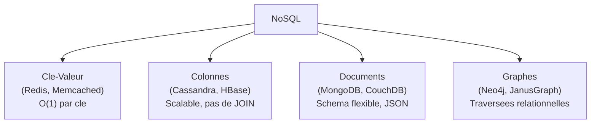
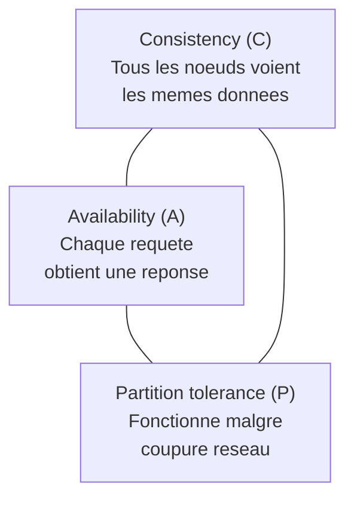
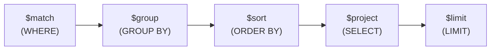

# Chapitre 07 -- Bases de Donnees NoSQL

> **Idee centrale :** NoSQL n'est pas "mieux" que SQL, c'est **different**. Chaque famille NoSQL resout un probleme specifique : donnees massives (Cassandra), structure flexible (MongoDB), relations complexes (Neo4j), acces ultra-rapide (Redis).

---

## 1. Les 4 familles NoSQL



### Comparaison globale

| Critere | Cle-Valeur | Colonnes | Documents | Graphes |
|---------|-----------|----------|-----------|---------|
| Modele | Paire (cle, valeur) | Lignes a colonnes variables | Objets JSON/BSON | Noeuds + aretes |
| Requetes | GET/SET par cle | CQL (~ SQL) | find(), aggregate() | Cypher, Gremlin |
| Scalabilite | Horizontale | Horizontale (excellente) | Horizontale | Verticale |
| Jointures | Non | Non | Limitees ($lookup) | Traversees natives |
| Schema | Aucun | Par table | Flexible | Flexible (labels) |
| Cas d'usage | Cache, sessions | Logs, IoT, series temporelles | Apps web, catalogues | Reseaux, recommandations |
| Exemples | Redis, Memcached | Cassandra, HBase | MongoDB, CouchDB | Neo4j, JanusGraph |

---

## 2. Theoreme CAP

Dans un systeme distribue, il est **impossible** de garantir simultanement :



| Choix | Garantie | Sacrifice | Exemples |
|-------|----------|-----------|----------|
| **CP** | Coherence | Disponibilite | MongoDB, HBase, Redis |
| **AP** | Disponibilite | Coherence | Cassandra, CouchDB, DynamoDB |
| **CA** | Les deux | Tolerance aux partitions (= un seul serveur) | PostgreSQL, MySQL |

---

## 3. Cassandra (TP2 -- Column-family)

### Modele de donnees

| Concept | Description | Equivalent SQL |
|---------|-------------|---------------|
| **Keyspace** | Conteneur de tables | Database / Schema |
| **Table** | Collection de lignes | Table |
| **Partition key** | Cle de **distribution** des donnees entre les noeuds | -- |
| **Clustering key** | Cle de **tri** dans une partition | -- |
| **Primary key** | Partition key + clustering key | Cle primaire |

### CQL (Cassandra Query Language)

```sql
-- Creer un keyspace
CREATE KEYSPACE magasin
WITH replication = {'class': 'SimpleStrategy', 'replication_factor': 3};

USE magasin;

-- Creer une table
CREATE TABLE ventes (
    region TEXT,
    date_vente DATE,
    produit TEXT,
    montant DECIMAL,
    PRIMARY KEY ((region), date_vente, produit)
    -- partition key : region
    -- clustering keys : date_vente, produit (tri)
);

-- Inserer
INSERT INTO ventes (region, date_vente, produit, montant)
VALUES ('Bretagne', '2024-03-15', 'Laptop', 999.99);

-- Requetes AUTORISEES (filtrent par partition key)
SELECT * FROM ventes WHERE region = 'Bretagne';
SELECT * FROM ventes WHERE region = 'Bretagne' AND date_vente > '2024-01-01';

-- INTERDIT (pas de partition key dans le WHERE)
-- SELECT * FROM ventes WHERE produit = 'Laptop';
-- => Error: cannot execute without partition key
```

### Regles de conception Cassandra

| Regle | Explication |
|-------|-------------|
| Modeliser **par les requetes** | Concevoir les tables en fonction des requetes prevues (inverse du SQL) |
| **Denormaliser** | Dupliquer les donnees pour eviter les jointures |
| **Pas de JOIN** | Tout doit etre dans une seule table |
| Partition key = distribution | Choisir une partition key qui distribue uniformement |
| Clustering key = tri | Les donnees dans une partition sont triees par clustering key |

### Cassandra vs SQL

| Aspect | SQL (PostgreSQL) | Cassandra |
|--------|-----------------|-----------|
| Schema | Normalise (3NF) | Denormalise (par requete) |
| Jointures | Oui (JOIN) | Non |
| Transactions | ACID completes | Par partition uniquement |
| Scalabilite | Verticale | Horizontale (lineaire) |
| Requetes | Tout filtre possible | Partition key obligatoire |
| Coherence | Forte | Eventuelle (configurable) |

---

## 4. Neo4j (TP3 -- Graphe)

### Modele de donnees

| Element | Description | Syntaxe Cypher |
|---------|-------------|---------------|
| **Noeud** | Entite | `(n:Label {prop: val})` |
| **Relation** | Lien dirige entre noeuds | `-[r:TYPE {prop: val}]->` |
| **Label** | Type du noeud | `:Etudiant`, `:Cours` |
| **Propriete** | Attribut | `{nom: "Alice", age: 22}` |

### Cypher (langage de requete)

```cypher
// Creer des noeuds et relations
CREATE (a:Etudiant {nom: "Alice", age: 22})
CREATE (b:Etudiant {nom: "Bob", age: 23})
CREATE (c:Cours {nom: "Bases de Donnees"})
CREATE (p:Prof {nom: "Dupont"})
CREATE (a)-[:INSCRIT_A]->(c)
CREATE (b)-[:INSCRIT_A]->(c)
CREATE (p)-[:ENSEIGNE]->(c)
CREATE (a)-[:AMI_DE]->(b)

// Trouver les etudiants inscrits au cours BD
MATCH (e:Etudiant)-[:INSCRIT_A]->(c:Cours {nom: "Bases de Donnees"})
RETURN e.nom

// Amis des amis d'Alice (profondeur 2)
MATCH (a:Etudiant {nom: "Alice"})-[:AMI_DE*2]-(fof:Etudiant)
WHERE fof <> a
RETURN DISTINCT fof.nom

// Chemin le plus court
MATCH p = shortestPath(
    (a:Etudiant {nom: "Alice"})-[*]-(b:Etudiant {nom: "Charlie"})
)
RETURN p

// Compter les inscriptions par cours
MATCH (e:Etudiant)-[:INSCRIT_A]->(c:Cours)
RETURN c.nom, count(e) AS nb_inscrits
ORDER BY nb_inscrits DESC

// Relation non dirigee (les deux sens)
MATCH (a)-[:AMI_DE]-(b)
RETURN a.nom, b.nom
```

### Quand utiliser un graphe ?

| Cas d'usage | Pourquoi |
|-------------|---------|
| Reseau social | Amis, followers, recommandations |
| Detection de fraude | Patterns de connexions suspectes |
| Recommandation | "Les gens qui aiment X aiment aussi Y" |
| Genealogie | Ancetres, descendants |
| Transport | Plus court chemin, accessibilite |

---

## 5. MongoDB (TP4 -- Documents)

### Modele de donnees

| MongoDB | SQL |
|---------|-----|
| Database | Database |
| **Collection** | Table |
| **Document** | Ligne (tuple) |
| **Field** | Colonne (attribut) |
| **_id** | Cle primaire (auto-generee) |

### Requetes de base

```javascript
// Inserer
db.etudiants.insertOne({
    nom: "Alice Dupont",
    age: 22,
    cours: ["BD", "Algo", "Reseaux"],
    adresse: { ville: "Rennes", cp: "35000" }
});

// Trouver tous
db.etudiants.find()

// Filtrer (WHERE)
db.etudiants.find({ age: { $gt: 21 } })
db.etudiants.find({ cours: "BD" })
db.etudiants.find({ "adresse.ville": "Rennes" })  // dot notation

// Projection (SELECT colonnes)
db.etudiants.find({ age: { $gt: 21 } }, { nom: 1, age: 1, _id: 0 })

// Tri (ORDER BY)
db.etudiants.find().sort({ age: -1 })  // -1 = decroissant
```

### Operateurs de requete

| Operateur | SQL equivalent | Exemple |
|-----------|---------------|---------|
| `$eq` | `=` | `{ age: { $eq: 22 } }` |
| `$ne` | `<>` | `{ age: { $ne: 22 } }` |
| `$gt`, `$gte` | `>`, `>=` | `{ age: { $gt: 21 } }` |
| `$lt`, `$lte` | `<`, `<=` | `{ age: { $lt: 25 } }` |
| `$in` | `IN` | `{ cours: { $in: ["BD", "Algo"] } }` |
| `$exists` | `IS [NOT] NULL` | `{ stage: { $exists: true } }` |
| `$and`, `$or` | `AND`, `OR` | `{ $or: [{ age: 22 }, { age: 23 }] }` |
| `$regex` | `LIKE` | `{ nom: { $regex: /^A/ } }` |

### Pipeline d'agregation



```javascript
db.etudiants.aggregate([
    { $match: { age: { $gt: 20 } } },
    { $group: {
        _id: "$adresse.ville",
        nb: { $sum: 1 },
        age_moyen: { $avg: "$age" }
    }},
    { $sort: { nb: -1 } }
])
```

---

## 6. Comparaison SQL vs NoSQL -- Table de reference pour l'examen

| Critere | SQL (Relationnel) | Cassandra | Neo4j | MongoDB |
|---------|-------------------|-----------|-------|---------|
| **Modele** | Tables, lignes, colonnes | Colonnes (partitions) | Graphe (noeuds, aretes) | Documents (JSON) |
| **Schema** | Rigide, defini | Par table | Flexible (labels) | Flexible |
| **Langage** | SQL | CQL (~SQL) | Cypher | JavaScript/JSON |
| **Jointures** | JOIN natif | Non | Traversees | $lookup (limite) |
| **Transactions** | ACID completes | Par partition | ACID (Neo4j 4+) | ACID (4.0+) |
| **Scalabilite** | Verticale | Horizontale | Verticale | Horizontale |
| **CAP** | CA | AP | CP | CP |
| **Coherence** | Forte | Eventuelle | Forte | Forte (par defaut) |
| **Cas d'usage** | OLTP, donnees structurees | IoT, logs, series temporelles | Reseaux, recommandations | Apps web, catalogues |
| **Normalisation** | 3NF/BCNF | Denormalise | -- | Denormalise |
| **Index** | B-tree, Hash | Par partition | Natifs sur proprietes | B-tree, Hash, GeoSpatial |

---

## 7. Pieges classiques

| Piege | Explication |
|-------|-------------|
| Appliquer la pensee SQL au NoSQL | En NoSQL on denormalise et on duplique. |
| Choisir NoSQL "parce que c'est tendance" | Chaque modele a ses forces. SQL reste le meilleur pour les donnees structurees avec transactions. |
| Filtrer sans partition key en Cassandra | Requete rejetee ou scan complet du cluster. |
| Confondre direction des relations en Cypher | `-->` est dirige, `--` est non dirige. |
| Oublier _id dans MongoDB | Auto-genere. Deux documents identiques ont des _id differents. |
| Confondre coherence forte et eventuelle | Forte = lecture toujours a jour. Eventuelle = temporairement incoherent. |

---

## CHEAT SHEET

```
4 FAMILLES :
  Cle-Valeur  : GET/SET, O(1), cache       (Redis)
  Colonnes    : CQL, partitions, scalable   (Cassandra)
  Documents   : JSON, flexible, aggregate   (MongoDB)
  Graphes     : Cypher, traversees          (Neo4j)

CAP : C + A + P impossible simultanement
  CP : MongoDB, Neo4j   (coherent mais peut bloquer)
  AP : Cassandra         (disponible mais coherence eventuelle)
  CA : PostgreSQL        (pas distribue)

CASSANDRA :
  CREATE TABLE t (pk TEXT, ck INT, val TEXT, PRIMARY KEY ((pk), ck));
  SELECT * FROM t WHERE pk = 'x' AND ck > 10;
  REGLE : toujours filtrer par partition key

NEO4J (Cypher) :
  CREATE (n:Label {prop: val})-[:REL]->(m:Label2)
  MATCH (n:Label)-[:REL]->(m) WHERE n.prop > val RETURN m
  shortestPath((a)-[*]-(b))

MONGODB :
  db.col.find({ champ: { $gt: val } })
  db.col.aggregate([
    { $match: ... },
    { $group: { _id: "$champ", total: { $sum: "$val" } } },
    { $sort: { total: -1 } }
  ])

ACID (SQL) vs BASE (NoSQL) :
  ACID : Atomicity, Consistency, Isolation, Durability
  BASE : Basically Available, Soft state, Eventually consistent
```
