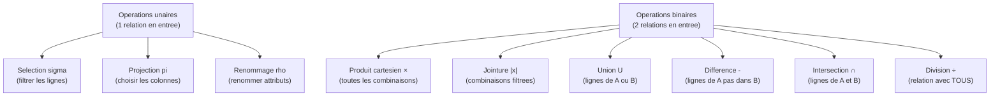

# Chapitre 08 -- Algebre Relationnelle

> **Idee centrale :** L'algebre relationnelle est le langage mathematique qui definit les operations sur les relations. C'est le fondement theorique de SQL : chaque requete SQL correspond a une expression d'algebre relationnelle.

---

## 1. Operations fondamentales

### Vue d'ensemble



---

## 2. Selection (sigma)

Filtre les **lignes** selon une condition. Equivalent de WHERE en SQL.

**Notation :** `sigma_{condition}(R)`

```
sigma_{prix > 10}(Livre)
```

```sql noexec
-- Equivalent SQL
SELECT * FROM Livre WHERE prix > 10;
```

**Proprietes :**
- Le resultat a le meme schema que R.
- La cardinalite du resultat est <= a celle de R.
- Selection commutative : `sigma_c1(sigma_c2(R))` = `sigma_c2(sigma_c1(R))`
- Selection cascade : `sigma_{c1 AND c2}(R)` = `sigma_c1(sigma_c2(R))`

---

## 3. Projection (pi)

Selectionne des **colonnes** specifiques. Equivalent de SELECT (avec colonnes) en SQL.

**Notation :** `pi_{attributs}(R)`

```
pi_{titre, auteur}(Livre)
```

```sql noexec
-- Equivalent SQL
SELECT DISTINCT titre, auteur FROM Livre;
```

**Attention :** en algebre relationnelle, la projection **elimine les doublons** (comme SELECT DISTINCT). En SQL standard, SELECT ne supprime pas les doublons sauf si DISTINCT est specifie.

---

## 4. Produit cartesien (x)

Combine **chaque ligne** d'une relation avec **chaque ligne** de l'autre.

**Notation :** `R1 x R2`

Si R1 a n lignes et R2 a m lignes, le resultat a n * m lignes.

```sql noexec
-- Equivalent SQL
SELECT * FROM etudiant, professeur;
-- 73 x 25 = 1825 lignes
```

**Utilite :** rarement utilise seul. Le produit cartesien suivi d'une selection donne une **jointure**.

---

## 5. Jointure (|x|)

Combine deux relations en ne gardant que les lignes **correspondantes**.

### 5.1 Theta-jointure

Jointure avec une condition quelconque.

**Notation :** `R1 |x|_{condition} R2`

```
etudiant |x|_{etudiant.etudId = enseignementSuivi.etudId} enseignementSuivi
```

```sql noexec
SELECT *
FROM etudiant e
JOIN enseignementSuivi es ON e.etudId = es.etudId;
```

### 5.2 Equi-jointure

Theta-jointure ou la condition est une **egalite**.

### 5.3 Jointure naturelle

Jointure automatique sur les **colonnes de meme nom**.

**Notation :** `R1 |x| R2`

```sql noexec
SELECT * FROM customer NATURAL JOIN facture;
-- Joint automatiquement sur customerId (colonne commune)
```

### 5.4 Jointures externes

| Type | Notation | Description |
|------|----------|-------------|
| Jointure gauche | `R1 LEFT JOIN R2` | Toutes les lignes de R1 + correspondances de R2 |
| Jointure droite | `R1 RIGHT JOIN R2` | Toutes les lignes de R2 + correspondances de R1 |
| Jointure complete | `R1 FULL OUTER JOIN R2` | Toutes les lignes des deux cotes |

```sql noexec
-- Tous les clients, meme sans facture
SELECT c.name, f.amount
FROM customer c
LEFT JOIN facture f ON c.customerId = f.customerId;
```

### Decomposition de la jointure

La jointure est equivalente a un produit cartesien suivi d'une selection :

```
R1 |x|_{cond} R2  =  sigma_{cond}(R1 x R2)
```

---

## 6. Operations ensemblistes

Les deux relations doivent avoir le **meme schema** (memes attributs, memes types).

### Union (U)

Toutes les lignes de R1 **ou** R2 (sans doublons).

```
pi_{etudId}(inscription_maths)  U  pi_{etudId}(inscription_physique)
```

```sql noexec
SELECT etudId FROM inscription_maths
UNION
SELECT etudId FROM inscription_physique;
```

### Difference (-)

Lignes de R1 qui ne sont **pas** dans R2.

```
pi_{etudId}(inscription_maths)  -  pi_{etudId}(inscription_physique)
```

```sql noexec
SELECT etudId FROM inscription_maths
EXCEPT
SELECT etudId FROM inscription_physique;
```

### Intersection (cap)

Lignes presentes dans R1 **et** dans R2.

```
pi_{etudId}(inscription_maths)  ∩  pi_{etudId}(inscription_physique)
```

```sql noexec
SELECT etudId FROM inscription_maths
INTERSECT
SELECT etudId FROM inscription_physique;
```

**Note :** l'intersection est derivable : `R1 ∩ R2 = R1 - (R1 - R2)`

---

## 7. Division (div)

Repond a la question : "Quels elements sont en relation avec **TOUS** les elements d'un ensemble ?"

**Notation :** `R1 div R2`

### Exemple

"Quels etudiants sont inscrits a **tous** les cours ?"

```
pi_{etudId, ensId}(enseignementSuivi)  div  pi_{ensId}(enseignement)
```

### Realisation en algebre relationnelle

```
R1 div R2 = pi_X(R1) - pi_X( (pi_X(R1) x R2) - R1 )

Ou X = attributs de R1 qui ne sont pas dans R2
```

### Realisation en SQL

```sql noexec
-- Methode 1 : double NOT EXISTS
SELECT e.etudId
FROM etudiant e
WHERE NOT EXISTS (
    SELECT ens.ensId
    FROM enseignement ens
    WHERE NOT EXISTS (
        SELECT * FROM enseignementSuivi es
        WHERE es.etudId = e.etudId AND es.ensId = ens.ensId
    )
);

-- Methode 2 : comptage
SELECT es.etudId
FROM enseignementSuivi es
GROUP BY es.etudId
HAVING COUNT(DISTINCT es.ensId) = (SELECT COUNT(*) FROM enseignement);
```

---

## 8. Renommage (rho)

Renomme une relation ou ses attributs.

**Notation :** `rho_{nouveau_nom(a1, a2, ...)}(R)`

Utile pour les auto-jointures ou quand deux relations ont des colonnes de meme nom.

```sql noexec
-- Auto-jointure : etudiants inscrits aux memes cours
SELECT e1.nom, e2.nom, es1.ensId
FROM enseignementSuivi es1
JOIN enseignementSuivi es2 ON es1.ensId = es2.ensId AND es1.etudId < es2.etudId
JOIN etudiant e1 ON es1.etudId = e1.etudId
JOIN etudiant e2 ON es2.etudId = e2.etudId;
```

---

## 9. Equivalences algebre relationnelle / SQL

| Algebre relationnelle | SQL |
|---|---|
| `sigma_{condition}(R)` | `SELECT * FROM R WHERE condition` |
| `pi_{A,B}(R)` | `SELECT DISTINCT A, B FROM R` |
| `R1 x R2` | `SELECT * FROM R1 CROSS JOIN R2` |
| `R1 \|x\|_{cond} R2` | `SELECT * FROM R1 JOIN R2 ON cond` |
| `R1 \|x\| R2` | `SELECT * FROM R1 NATURAL JOIN R2` |
| `R1 U R2` | `R1 UNION R2` |
| `R1 - R2` | `R1 EXCEPT R2` |
| `R1 ∩ R2` | `R1 INTERSECT R2` |
| `R1 div R2` | `NOT EXISTS (... NOT EXISTS ...)` |

---

## 10. Proprietes et optimisations

| Propriete | Description |
|-----------|-------------|
| Selection commutative | `sigma_c1(sigma_c2(R))` = `sigma_c2(sigma_c1(R))` |
| Selection cascade | `sigma_{c1 AND c2}(R)` = `sigma_c1(sigma_c2(R))` |
| Projection cascade | `pi_L1(pi_L2(R))` = `pi_L1(R)` si L1 dans L2 |
| Jointure commutative | `R1 |x| R2` = `R2 |x| R1` |
| Jointure associative | `(R1 |x| R2) |x| R3` = `R1 |x| (R2 |x| R3)` |
| Selection avant jointure | `sigma_c(R1 |x| R2)` = `sigma_c(R1) |x| R2` si c ne porte que sur R1 |

**Regle d'optimisation :** pousser les selections et projections le plus pres possible des feuilles de l'arbre d'execution pour reduire la taille des resultats intermediaires.

---

## CHEAT SHEET

```
SELECTION    : sigma_{cond}(R)         -> WHERE
PROJECTION   : pi_{cols}(R)            -> SELECT DISTINCT
PROD. CART.  : R1 x R2                 -> CROSS JOIN
JOINTURE     : R1 |x|_{cond} R2       -> JOIN ... ON
JOINTURE NAT.: R1 |x| R2              -> NATURAL JOIN
UNION        : R1 U R2                 -> UNION
DIFFERENCE   : R1 - R2                 -> EXCEPT
INTERSECTION : R1 ∩ R2                 -> INTERSECT
DIVISION     : R1 div R2              -> NOT EXISTS (NOT EXISTS ...)
RENOMMAGE    : rho_{nom}(R)            -> AS

PROPRIETES :
  sigma commutative et cascade
  pi cascade (si L1 dans L2)
  |x| commutative et associative
  Pousser sigma/pi vers les feuilles pour optimiser

DIVISION EN SQL :
  SELECT x FROM T1
  WHERE NOT EXISTS (
    SELECT y FROM T2
    WHERE NOT EXISTS (
      SELECT * FROM T3
      WHERE T3.x = T1.x AND T3.y = T2.y))
```
