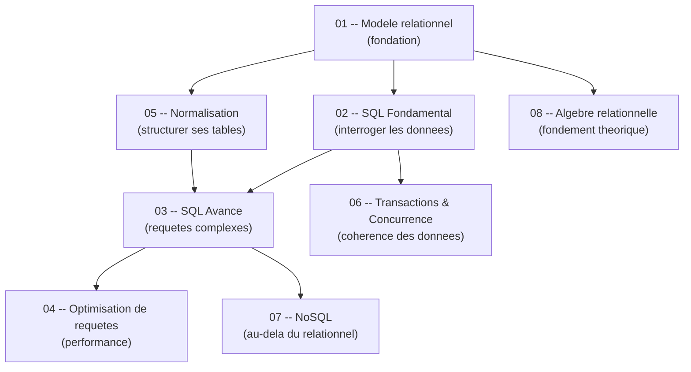

# Bases de Donnees -- Guide de cours (S6, INSA Rennes)

Guide complet pour le cours de Bases de Donnees, 3e annee informatique. Chaque chapitre contient la theorie, des exemples SQL, des schemas, des tables de comparaison et un **cheat sheet** en fin de fichier.

---

## Roadmap d'apprentissage

---

## Table des matieres

| # | Chapitre | Fichier | Description |
|---|----------|---------|-------------|
| 01 | Modele relationnel | [01_relational_model.md](/S6/Bases_de_Donnees/guide/01-relational-model) | Relations, tuples, attributs, cles, contraintes |
| 02 | SQL Fondamental | [02_sql_fundamentals.md](/S6/Bases_de_Donnees/guide/02-sql-fundamentals) | SELECT, FROM, WHERE, JOIN, GROUP BY, HAVING, ORDER BY, sous-requetes |
| 03 | SQL Avance | [03_advanced_sql.md](/S6/Bases_de_Donnees/guide/03-advanced-sql) | Fonctions fenetres, CTEs, vues, procedures stockees, triggers |
| 04 | Optimisation de requetes | [04_query_optimization.md](/S6/Bases_de_Donnees/guide/04-query-optimization) | Plans d'execution, index B-tree/hash, strategies d'evaluation |
| 05 | Normalisation | [05_normalization.md](/S6/Bases_de_Donnees/guide/05-normalization) | 1NF, 2NF, 3NF, BCNF, dependances fonctionnelles, decomposition |
| 06 | Transactions & Concurrence | [06_transactions_concurrency.md](/S6/Bases_de_Donnees/guide/06-transactions-concurrency) | ACID, niveaux d'isolation, verrous, deadlocks, WAL |
| 07 | NoSQL | [07_nosql_databases.md](/S6/Bases_de_Donnees/guide/07-nosql-databases) | MongoDB, Cassandra, Neo4j, cle-valeur |
| 08 | Algebre relationnelle | [08_relational_algebra.md](/S6/Bases_de_Donnees/guide/08-relational-algebra) | Selection, projection, jointure, union, difference, produit cartesien |

---

## Correspondance avec les materiaux du cours

| Chapitre du guide | Cours PDF | TD | TP |
|---|---|---|---|
| 01 - Modele relationnel | poly_etudiants_CM1 | TD1, TD2 | -- |
| 02 - SQL Fondamental | 2-cours2016_part2, 3-cours2016_part3 | TD1, TD2 | -- |
| 03 - SQL Avance | 2-cours2016_part2, 3-cours2016_part3 | TD2 | TP1 |
| 04 - Optimisation de requetes | 2-cours2016_part2 | -- | TP1 (evaluation de requetes) |
| 05 - Normalisation | 1-cours_DF_FN | TD3-4 | -- |
| 06 - Transactions & Concurrence | 3-cours2016_part3 | -- | -- |
| 07 - NoSQL | NoSQL-court-6 | TD7 | TP2 (Cassandra), TP3 (Neo4j), TP4 (MongoDB) |
| 08 - Algebre relationnelle | poly_etudiants_CM1 | TD1, TD2 | -- |

---

## Prerequis

- Savoir ce qu'est un tableau (lignes et colonnes).
- Avoir un SGBD installe (SQLite suffit) : <https://www.sqlite.org/download.html>

## Comment utiliser ce guide

1. **Lis dans l'ordre** pour une progression naturelle, ou saute au chapitre qui t'interesse.
2. **Reproduis le code SQL** dans SQLite ou PostgreSQL.
3. **Les diagrammes Mermaid** sont rendus sur GitHub et Obsidian.
4. Chaque chapitre se termine par un **CHEAT SHEET** pour revision rapide.
