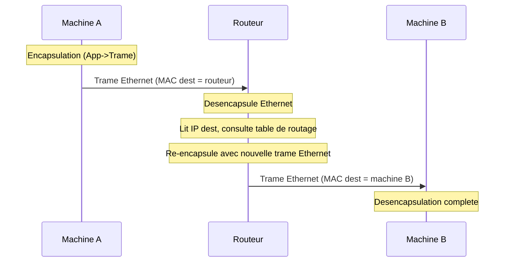

# 01 -- Modele OSI & TCP/IP

## Vue d'ensemble

Les reseaux informatiques sont organises en **couches**. Chaque couche a une responsabilite precise et ne communique qu'avec ses voisines directes. Deux modeles coexistent :

- **OSI** (7 couches) : modele theorique de reference, utilise pour decrire et enseigner.
- **TCP/IP** (4 couches) : modele pratique utilise sur Internet.

---

## Les 7 couches OSI

```
+---+------------------+-----------------------------+-------------------+
| # | Couche           | Role                        | Exemples          |
+---+------------------+-----------------------------+-------------------+
| 7 | Application      | Interface utilisateur       | HTTP, DNS, FTP    |
| 6 | Presentation     | Format, chiffrement         | SSL/TLS, JPEG     |
| 5 | Session          | Gestion des sessions        | NetBIOS, RPC      |
| 4 | Transport        | Fiabilite bout en bout      | TCP, UDP          |
| 3 | Reseau           | Adressage et routage        | IP, ICMP          |
| 2 | Liaison          | Communication locale        | Ethernet, WiFi    |
| 1 | Physique         | Signaux electriques/optiques| Cables, fibre     |
+---+------------------+-----------------------------+-------------------+
```

En pratique, les couches 5, 6 et 7 sont souvent fusionnees. En DS, on distingue rarement les couches 5 et 6.

---

## Les 4 couches TCP/IP

| Couche TCP/IP | Correspond a (OSI) | Protocoles principaux | Unite de donnees |
|---------------|--------------------|-----------------------|------------------|
| Application | 5, 6, 7 | HTTP, DNS, FTP, SMTP, SSH, DHCP | Message |
| Transport | 4 | TCP, UDP | Segment / Datagramme |
| Internet | 3 | IP, ICMP, ARP | Paquet |
| Acces reseau | 1, 2 | Ethernet, WiFi, PPP | Trame |

---

## Encapsulation

Concept central des reseaux : chaque couche ajoute son **en-tete** (header) aux donnees avant de les passer a la couche du dessous.

```
Couche Application :  [Donnees]
                        |
Couche Transport :    [En-tete TCP/UDP][Donnees]              = segment
                        |
Couche Internet :     [En-tete IP][En-tete TCP][Donnees]      = paquet
                        |
Couche Acces reseau : [Eth Header][IP Header][TCP][Donnees][FCS] = trame
```

A la reception, c'est l'inverse : chaque couche retire son en-tete (**desencapsulation**).

**Regle d'or** : l'adresse IP ne change pas de bout en bout (sauf NAT). L'adresse MAC change a chaque saut (routeur).

---

## Noms des unites de donnees

| Couche | Unite | Exemple |
|--------|-------|---------|
| Application | Message / Donnees | Page HTML, requete DNS |
| Transport | Segment (TCP) / Datagramme (UDP) | Segment avec port 80 |
| Internet | Paquet | Paquet IP avec @dest |
| Liaison | Trame (frame) | Trame Ethernet avec @MAC |
| Physique | Bit | Signal electrique 0 ou 1 |

Astuce memoire : **D**onnees, **S**egment, **P**aquet, **T**rame, **B**it -- "**D**es **S**egments de **P**aquets **T**raversent des **B**its".

---

## Protocoles cles par couche

| Protocole applicatif | Transport | Port standard |
|---------------------|-----------|---------------|
| HTTP | TCP | 80 |
| HTTPS | TCP | 443 |
| DNS | UDP (et TCP) | 53 |
| FTP | TCP | 20, 21 |
| SSH | TCP | 22 |
| SMTP | TCP | 25 |
| DHCP | UDP | 67/68 |
| POP3 | TCP | 110 |
| IMAP | TCP | 143 |

---

## Communication entre deux machines (differents reseaux)



**Point cle** : l'adresse IP reste la meme de bout en bout. L'adresse MAC change a chaque saut.

---

## OSI vs TCP/IP

| Critere | OSI | TCP/IP |
|---------|-----|--------|
| Nombre de couches | 7 | 4 |
| Origine | ISO (1984) | DARPA (1970s) |
| Approche | Theorique | Pratique |
| Couches 5-6-7 | Separees | Fusionnees (Application) |
| Couches 1-2 | Separees | Fusionnees (Acces reseau) |
| Usage reel | Reference pedagogique | Utilise sur Internet |

---

## Pieges classiques

1. **Confondre couche et protocole** : la couche est un niveau d'abstraction, le protocole est une regle de communication a ce niveau.
2. **OSI n'est pas utilise sur Internet** : Internet utilise TCP/IP. OSI est un cadre theorique.
3. **L'adresse MAC change a chaque saut** : l'en-tete Ethernet est reconstruit par chaque routeur.
4. **Confondre segment, paquet et trame** : segment = transport, paquet = reseau, trame = liaison.
5. **ARP a la frontiere couches 2-3** : souvent classe en couche Internet (TCP/IP), parfois couche 2 (OSI).

---

## CHEAT SHEET

```
OSI :    Application > Presentation > Session > Transport > Reseau > Liaison > Physique
TCP/IP : Application > Transport > Internet > Acces reseau

Encapsulation : Donnees -> Segment -> Paquet -> Trame -> Bits

Adresse IP   = bout en bout (ne change pas, sauf NAT)
Adresse MAC  = saut par saut (change a chaque routeur)
Port         = identifie une application

HTTP=80  HTTPS=443  DNS=53  SSH=22  FTP=20/21  SMTP=25  DHCP=67/68
```
