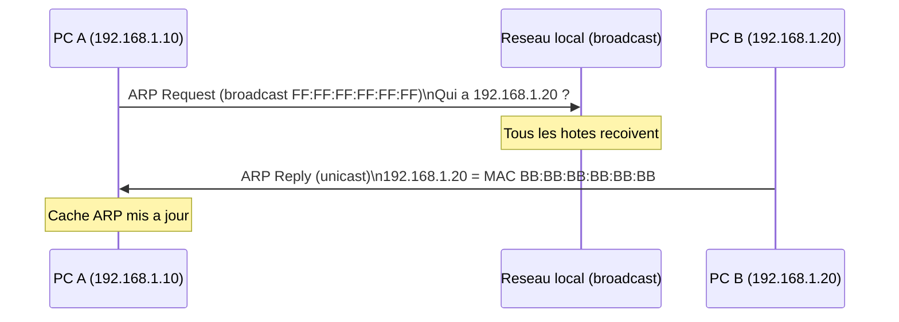

# 02 -- Couche physique & liaison de donnees

## Vue d'ensemble

La couche liaison (couche 2) gere la communication entre machines **directement connectees** sur le meme reseau local (LAN). Ethernet est le protocole dominant.

---

## Adresse MAC

Chaque carte reseau possede une adresse MAC (Media Access Control) :

- **Taille** : 6 octets (48 bits)
- **Format** : `AA:BB:CC:DD:EE:FF`
- **Structure** : 3 premiers octets = OUI (fabricant), 3 derniers = interface unique

**Adresses speciales :**

| Adresse | Signification |
|---------|---------------|
| `FF:FF:FF:FF:FF:FF` | Broadcast (tout le LAN) |
| `01:00:5E:xx:xx:xx` | Multicast IPv4 |
| `00:00:00:00:00:00` | Non attribuee |

**Commandes :**
```bash
ip link show        # Linux
ifconfig            # Linux (ancien)
ipconfig /all       # Windows
```

---

## Trame Ethernet II

```
+----------+----------+------+---------+-----+
| Dest MAC | Src MAC  | Type | Payload | FCS |
| 6 octets | 6 octets | 2 o  | 46-1500 | 4 o |
+----------+----------+------+---------+-----+
```

| Champ | Taille | Description |
|-------|--------|-------------|
| Preambule + SFD | 8 octets | Synchronisation (pas toujours compte) |
| Destination MAC | 6 octets | MAC du destinataire |
| Source MAC | 6 octets | MAC de l'emetteur |
| EtherType | 2 octets | Protocole encapsule |
| Payload | 46-1500 octets | Donnees (paquet IP, etc.) |
| FCS | 4 octets | Detection d'erreurs CRC-32 |

**EtherType courants :**

| Valeur | Protocole |
|--------|-----------|
| 0x0800 | IPv4 |
| 0x0806 | ARP |
| 0x86DD | IPv6 |
| 0x8100 | VLAN (802.1Q) |

**Tailles :**
- Minimum : 64 octets (14 header + 46 payload + 4 FCS). Si payload < 46 octets, **padding** ajoute.
- Maximum : 1518 octets (14 + 1500 + 4).
- **MTU** (Maximum Transmission Unit) Ethernet : **1500 octets**.

---

## Hub vs Switch

| | Hub (obsolete) | Switch |
|---|-----|--------|
| Couche | 1 (physique) | 2 (liaison) |
| Envoi | Tous les ports | Port cible uniquement |
| Collisions | Oui (domaine partage) | Non (un domaine par port) |
| Table MAC | Non | Oui (auto-apprentissage) |

**Apprentissage de la table MAC du switch :**
1. PC A envoie une trame. Le switch note : "MAC de A = port 1".
2. Destination inconnue ? Flood sur tous les ports.
3. Quand le destinataire repond, le switch note aussi son port.
4. Les entrees expirent apres ~300 secondes sans trafic.

---

## CSMA/CD

Protocole de gestion des collisions sur les reseaux partages (bus, hub) :

1. **Carrier Sense** : ecouter avant d'emettre.
2. **Multiple Access** : plusieurs machines partagent le support.
3. **Collision Detection** : detecter les collisions pendant l'emission.
4. **Backoff exponentiel** : apres collision n, attendre un temps aleatoire entre 0 et 2^n slots.
5. Apres 16 collisions consecutives : abandon.

Avec les switches full-duplex modernes, **il n'y a plus de collisions**. Mais CSMA/CD est un classique d'examen.

---

## ARP (Address Resolution Protocol)

ARP resout les adresses IP en adresses MAC sur le reseau local.



**ARP Request** = broadcast Ethernet. **ARP Reply** = unicast.

**Structure du paquet ARP :**

| Champ | Taille | Description |
|-------|--------|-------------|
| Hardware Type | 2 octets | 1 = Ethernet |
| Protocol Type | 2 octets | 0x0800 = IPv4 |
| Hardware Size | 1 octet | 6 (taille MAC) |
| Protocol Size | 1 octet | 4 (taille IPv4) |
| Opcode | 2 octets | 1 = Request, 2 = Reply |
| Sender MAC | 6 octets | MAC de l'emetteur |
| Sender IP | 4 octets | IP de l'emetteur |
| Target MAC | 6 octets | 00:00:00:00:00:00 si inconnu |
| Target IP | 4 octets | IP cible |

**Cache ARP :** `arp -a` pour voir les associations IP-MAC. Expiration apres quelques minutes.

---

## VLAN (Virtual LAN)

Un VLAN segmente un switch physique en plusieurs reseaux logiques.

**Avantages :** securite (isoler les groupes), performance (limiter le broadcast), flexibilite.

**802.1Q (tagging) :** un tag de 4 octets est insere dans l'en-tete Ethernet sur les liens trunk.

```
+----------+----------+--------+------+---------+-----+
| Dest MAC | Src MAC  | 802.1Q | Type | Payload | FCS |
| 6 octets | 6 octets | 4 oct  | 2 o  | 46-1500 | 4 o |
+----------+----------+--------+------+---------+-----+
```

Le tag contient TPID (0x8100) + TCI (priorite + VLAN ID sur 12 bits = 4096 VLANs possibles).

Pour communiquer entre VLANs, il faut un **routeur** (routage inter-VLAN).

---

## Parcours complet d'une trame (meme LAN)

PC A (192.168.1.10, MAC AA) veut communiquer avec PC B (192.168.1.20, MAC BB) :

1. **ARP** (si necessaire) : A envoie ARP Request en broadcast, B repond avec sa MAC.
2. **Construction de la trame** : `[MAC BB][MAC AA][0x0800][Paquet IP][FCS]`
3. **Switch** : lit MAC dest BB, transmet sur le port de B.

---

## Pieges classiques

1. **MAC vs IP** : MAC = physique, locale, 6 octets, fixe. IP = logique, routable, 4 octets, peut changer.
2. **ARP Request = broadcast, ARP Reply = unicast** : asymetrie frequente en DS.
3. **Switch != routeur** : switch = couche 2 (MAC), routeur = couche 3 (IP).
4. **Padding Ethernet** : si donnees < 46 octets, padding ajoute.
5. **Hub != switch** : hub = tout a tous (couche 1), switch = table MAC (couche 2).

---

## CHEAT SHEET

```
Trame Ethernet : [MAC dest 6o][MAC src 6o][Type 2o][Payload 46-1500o][FCS 4o]
  Min = 64 octets | Max = 1518 octets | MTU = 1500 octets

EtherType : 0x0800=IPv4  0x0806=ARP  0x86DD=IPv6  0x8100=VLAN

ARP : IP -> MAC
  Request = broadcast (FF:FF:FF:FF:FF:FF)
  Reply   = unicast
  Cache ARP : arp -a

Switch : couche 2, table MAC, envoie au bon port
Hub    : couche 1, envoie a tous les ports (obsolete)

CSMA/CD : ecouter, emettre, detecter collision, backoff exponentiel
  Desactive avec switches full-duplex

VLAN : 802.1Q, VLAN ID sur 12 bits (0-4095)
  Routage inter-VLAN = routeur necessaire
```
