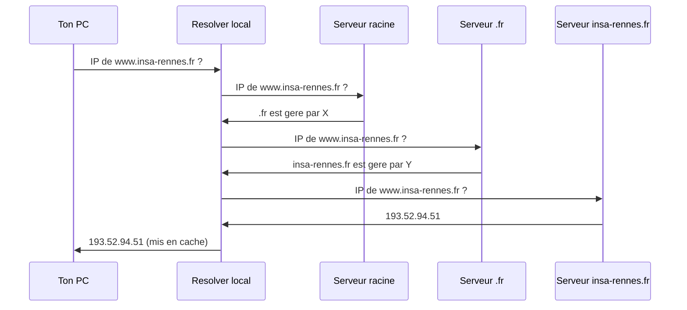

# 05 -- Couche application

## Vue d'ensemble

La couche application definit les regles de conversation entre les programmes. Chaque protocole applicatif specifie : qui parle en premier, le format des messages, et comment terminer l'echange.

---

## DNS (Domain Name System)

### Fonctionnement

DNS traduit les noms de domaine en adresses IP. Systeme **hierarchique et distribue**.

**Hierarchie** (de droite a gauche) : `.` (racine) > `fr` (TLD) > `insa-rennes` (domaine) > `www` (hote).

### Resolution iterative



### Types d'enregistrements

| Type | Description | Exemple |
|------|-------------|---------|
| A | Nom -> IPv4 | www -> 193.52.94.51 |
| AAAA | Nom -> IPv6 | www -> 2a00:1450:... |
| CNAME | Alias | blog -> example.github.io |
| MX | Serveur mail | insa -> mail.insa-rennes.fr |
| NS | Serveur DNS autoritaire | insa -> ns1.insa-rennes.fr |
| PTR | IP -> nom (inverse) | 51 -> www.insa-rennes.fr |

### Transport

- **UDP port 53** pour les requetes normales.
- **TCP port 53** pour les reponses > 512 octets et les transferts de zone.

**Commandes :**
```bash
nslookup www.insa-rennes.fr
dig www.insa-rennes.fr
dig +trace www.insa-rennes.fr     # Chaque etape de la resolution
dig MX insa-rennes.fr             # Enregistrement mail
```

---

## HTTP (HyperText Transfer Protocol)

### Requete

```
GET /index.html HTTP/1.1
Host: www.example.com
User-Agent: Mozilla/5.0
Accept: text/html
```

**Methodes :**

| Methode | Usage | Corps ? |
|---------|-------|---------|
| GET | Recuperer une ressource | Non |
| POST | Envoyer des donnees | Oui |
| PUT | Remplacer une ressource | Oui |
| DELETE | Supprimer une ressource | Non |
| HEAD | GET sans corps de reponse | Non |

### Reponse

```
HTTP/1.1 200 OK
Content-Type: text/html; charset=UTF-8
Content-Length: 1234

<!DOCTYPE html><html>...</html>
```

### Codes de reponse

| Code | Categorie | Exemples |
|------|-----------|----------|
| 2xx | Succes | 200 OK |
| 3xx | Redirection | 301 Moved Permanently, 302 Found |
| 4xx | Erreur client | 400 Bad Request, 403 Forbidden, 404 Not Found |
| 5xx | Erreur serveur | 500 Internal Error, 503 Unavailable |

### HTTP/1.0 vs HTTP/1.1

| | HTTP/1.0 | HTTP/1.1 |
|---|----------|----------|
| Connexion | Fermee apres chaque requete | Persistante (keep-alive) |
| Header Host | Optionnel | **Obligatoire** (virtual hosting) |
| Pipelining | Non | Oui |
| Chunked Transfer | Non | Oui |

**Test avec curl :**
```bash
curl -v http://www.example.com      # Requete detaillee
curl -I http://www.example.com      # Headers seulement
curl -X POST -d "data" http://url   # POST
```

---

## DHCP (Dynamic Host Configuration Protocol)

Attribue automatiquement la configuration reseau : IP, masque, passerelle, DNS.

### Processus DORA (4 etapes en broadcast UDP)

```
1. DISCOVER : client broadcast (0.0.0.0:68 -> 255.255.255.255:67)
2. OFFER    : serveur propose une IP
3. REQUEST  : client accepte l'offre (en broadcast)
4. ACK      : serveur confirme. Bail cree.
```

**Bail DHCP :** duree limitee (typiquement 24h). Renouvellement a 50% du bail.

---

## SMTP (Simple Mail Transfer Protocol)

- **Port 25** (TCP).
- Modele push : le client envoie le mail au serveur.
- Commandes texte : HELO, MAIL FROM, RCPT TO, DATA, QUIT.
- Pour recevoir : POP3 (port 110) ou IMAP (port 143).

---

## FTP (File Transfer Protocol)

Particularite : **deux connexions TCP**.

| Connexion | Port serveur | Role |
|-----------|-------------|------|
| Controle | 21 | Commandes et reponses |
| Donnees | 20 (actif) ou ephemere (passif) | Transfert de fichiers |

- **Mode actif** : le serveur se connecte au client (probleme avec firewalls/NAT).
- **Mode passif** : le client se connecte au serveur (plus courant).

---

## Conception d'un protocole applicatif

Pour le cours et les TP, on cree ses propres protocoles. A definir :

1. **Qui parle en premier ?** Client (HTTP) ou serveur (SMTP).
2. **Format des messages :** texte (facile a debugger) ou binaire (compact).
3. **Delimiteurs :** `\n`, longueur prefixee, marqueur de fin.
4. **Machine a etats :** connecte -> authentifie -> en transfert.
5. **Gestion des erreurs :** codes d'erreur, messages explicites.
6. **Terminaison :** commande QUIT, timeout, FIN TCP.

**Exemple TP3 (Plus ou Moins) :**
```
[CONNECTE] -> Serveur: "Guess 1-100" -> [EN_JEU]
[EN_JEU]   -> Client: nombre
             -> Serveur: "+" | "-" | "="
             -> Si "=" : [TERMINE]
```

---

## Pieges classiques

1. **DNS n'utilise pas toujours UDP** : TCP pour reponses > 512 octets et transferts de zone.
2. **HTTP est sans etat** : chaque requete est independante. Cookies/tokens pour les sessions.
3. **HTTP/1.1 : Header Host obligatoire** : sans lui, pas de virtual hosting.
4. **DHCP utilise du broadcast** : le client n'a pas encore d'IP.
5. **FTP actif vs passif** : actif = serveur vers client (bloque par firewalls), passif = client vers serveur.

---

## CHEAT SHEET

```
DNS : nom -> IP (UDP 53, TCP pour > 512 octets)
  Hierarchie : . > TLD > domaine > hote
  Enregistrements : A (IPv4), AAAA (IPv6), CNAME (alias), MX (mail), NS (DNS)

HTTP : TCP 80/443, requete/reponse, sans etat
  GET, POST, PUT, DELETE
  200=OK, 301=Moved, 400=Bad Request, 404=Not Found, 500=Error
  HTTP/1.1 : keep-alive, Host obligatoire

DHCP : UDP 67/68, broadcast, processus DORA
  Discover -> Offer -> Request -> Ack

FTP : TCP 21 (controle) + TCP 20 ou ephemere (donnees)
  Actif = serveur->client, Passif = client->serveur

SMTP : TCP 25 (envoi mail)
POP3 : TCP 110 (reception mail)
IMAP : TCP 143 (reception mail, synchronise)
```
