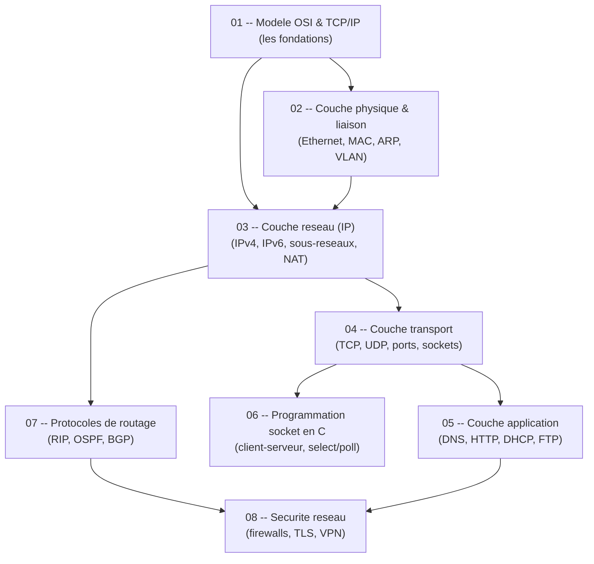

# Reseaux (Computer Networks) -- Course Guide

Guide complet du cours de Reseaux (S6, INSA Rennes 3INFO). Chaque chapitre est autonome et contient une explication progressive, des schemas de protocoles, des exemples de code C, et une cheat sheet.

---

## Roadmap d'apprentissage

---

## Table des matieres

| # | Chapitre | Description |
|---|----------|-------------|
| 01 | [Modele OSI & TCP/IP](/S6/Reseaux/guide/01-modele-osi-tcpip) | Architecture en couches, encapsulation, protocoles par couche |
| 02 | [Couche physique & liaison](/S6/Reseaux/guide/02-physique-liaison) | Ethernet, adresses MAC, ARP, switching, VLANs, CSMA/CD |
| 03 | [Couche reseau (IP)](/S6/Reseaux/guide/03-couche-reseau-ip) | IPv4, IPv6, sous-reseaux, CIDR, tables de routage, NAT, fragmentation |
| 04 | [Couche transport](/S6/Reseaux/guide/04-couche-transport) | TCP (3-way handshake, controle de flux, congestion), UDP, ports |
| 05 | [Couche application](/S6/Reseaux/guide/05-couche-application) | DNS, HTTP, SMTP, FTP, DHCP |
| 06 | [Programmation socket en C](/S6/Reseaux/guide/06-programmation-socket) | API POSIX, client-serveur TCP/UDP, select/poll, multicast |
| 07 | [Protocoles de routage](/S6/Reseaux/guide/07-protocoles-routage) | Vecteur de distance (RIP), etat de liens (OSPF), BGP |
| 08 | [Securite reseau](/S6/Reseaux/guide/08-securite-reseau) | Firewalls, TLS/SSL, VPN, filtrage de paquets |

---

## Liens avec les TP

| TP | Chapitres du guide |
|----|-------------------|
| TP1 -- Decouverte reseau (Wireshark) | 01 (OSI), 02 (Ethernet/ARP), 03 (IP/routage), 04 (TCP) |
| TP2 -- UDP/TCP en Java | 04 (TCP/UDP), 05 (HTTP) |
| TP3 -- Services TCP (Plus ou Moins) | 04 (TCP), 05 (protocoles applicatifs), 06 (sockets) |
| TP4 -- Sockets en C | 04 (TCP/UDP), 06 (programmation socket C) |
| TP5 -- Chat multicast | 03 (adressage multicast), 04 (UDP), 06 (multicast sockets, pthreads) |

---

## Liens avec les annales

| Theme d'examen | Chapitres |
|----------------|-----------|
| Calculs de sous-reseaux | 03 |
| Routage pas a pas (MAC/IP a chaque saut) | 02, 03, 07 |
| Three-way handshake TCP | 04 |
| Fragmentation IP | 03 |
| Analyse de captures Wireshark | 01, 02, 03, 04, 05 |
| Programmation socket (C) | 06 |
| Protocoles applicatifs (DNS, HTTP, DHCP) | 05 |
| Comparaison TCP vs UDP | 04 |

---

## Comment utiliser ce guide

1. **Lis dans l'ordre** pour une progression naturelle, ou saute directement au chapitre utile.
2. **Dessine les schemas** toi-meme : les reseaux s'apprennent en visualisant.
3. **Fais les calculs de sous-reseaux a la main** : c'est le type d'exercice le plus frequent en DS.
4. **Compile et execute les exemples C** : la programmation socket tombe regulierement en examen.
5. **Chaque chapitre se termine par une CHEAT SHEET** pour reviser en 5 minutes avant le DS.
