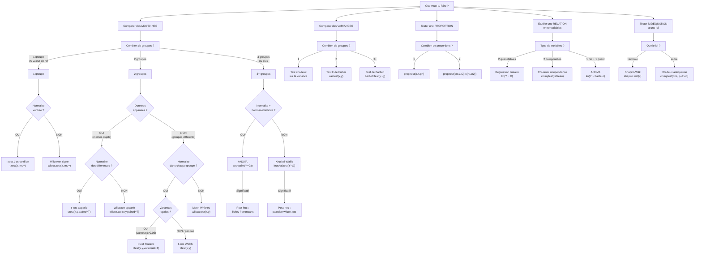

# Arbre de decision : quel test utiliser ?

> C'est **l'outil le plus precieux** pour l'examen. Imprime-le ou memorise-le.

---

## Flowchart principal



---

## Version texte (pour memorisation rapide)

### Comparer des MOYENNES

```
1 groupe vs reference
  └── Normal ? → OUI : t.test(x, mu=)
                 NON : wilcox.test(x, mu=)

2 groupes
  ├── Apparies (memes sujets)
  │   └── Normal ? → OUI : t.test(x, y, paired=TRUE)
  │                  NON : wilcox.test(x, y, paired=TRUE)
  │
  └── Independants (groupes differents)
      └── Normal ? → OUI → Variances egales ?
                           → OUI : t.test(x, y, var.equal=TRUE)
                           → NON : t.test(x, y)  [Welch, defaut]
                     NON : wilcox.test(x, y)

3+ groupes
  └── Normal + Homosced ? → OUI : anova(lm(Y ~ G))
                            NON : kruskal.test(Y ~ G)
```

### Comparer des VARIANCES

```
1 groupe   → chi² sur la variance
2 groupes  → var.test(x, y)       [F de Fisher]
3+ groupes → bartlett.test(y ~ g)  [Bartlett]
```

### Tester une PROPORTION

```
1 proportion  → prop.test(x, n, p = p0)
2 proportions → prop.test(c(x1, x2), c(n1, n2))
```

### Tester l'INDEPENDANCE

```
2 variables categorielles → chisq.test(tableau)
  Condition : effectifs theoriques >= 5
```

### Tester la NORMALITE

```
shapiro.test(x)
  Si p > 0.05 → normalite OK
  Si p < 0.05 → normalite rejetee
  
Complement visuel : qqnorm(x); qqline(x)
```

---

## Conditions d'application a verifier

| Test | Conditions |
|------|-----------|
| t-test (1 ou 2 ech.) | Normalite (Shapiro, QQ-plot) OU $n \geq 30$ |
| t-test apparie | Normalite des differences |
| t-test Student (2 ech.) | Variances egales (var.test) |
| ANOVA | Normalite (Shapiro) + Homoscedasticite (Bartlett) |
| Chi-deux | Effectifs theoriques $\geq 5$ |
| Test Z proportion | $n\hat{p} \geq 5$ et $n(1-\hat{p}) \geq 5$ |
| Kruskal-Wallis | Aucune (non parametrique) |

---

## Aide-memoire de conclusion

Toujours rediger la conclusion en 3 temps :

1. **Rappeler les hypotheses** : "On teste $H_0: \mu = 50$ contre $H_1: \mu \neq 50$"
2. **Donner le resultat** : "La statistique de test vaut $T = 2.5$, la p-value est $0.02$"
3. **Conclure en francais** :
   - Si $p < 0.05$ : "Au risque de 5%, on rejette $H_0$. On conclut que la moyenne differe significativement de 50."
   - Si $p \geq 0.05$ : "Au risque de 5%, on ne rejette pas $H_0$. On ne peut pas conclure a une difference significative."

**JAMAIS dire "on accepte $H_0$"** -- on dit "on ne rejette pas $H_0$".
