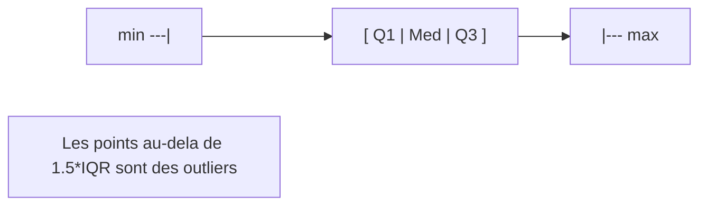

# Chapitre 01 -- Statistiques descriptives

> **Idee centrale :** Avant toute inference, il faut **decrire** les donnees -- les resumer, les visualiser, comprendre leur forme.

---

## 1. Analogie : la fiche d'identite d'une classe

Tu viens de recevoir les notes de 30 etudiants a un examen. Avant de tirer des conclusions ("les etudiants ont-ils bien travaille ?"), tu dois d'abord **decrire** ce que tu as sous les yeux :

- Quelle est la note "typique" ? (tendance centrale)
- Les notes sont-elles groupees ou dispersees ? (dispersion)
- Y a-t-il des notes extremes ? (valeurs aberrantes)
- Comment se repartissent les notes ? (forme de la distribution)

Les statistiques descriptives sont la **fiche d'identite** de tes donnees.

---

## 2. Mesures de tendance centrale

### 2.1 La moyenne arithmetique

La moyenne est la somme des valeurs divisee par leur nombre :

$$\bar{x} = \frac{1}{n} \sum_{i=1}^{n} x_i$$

- $n$ : nombre d'observations
- $x_i$ : la $i$-eme observation

**Propriete cle :** la somme des ecarts a la moyenne est toujours nulle : $\sum_{i=1}^{n}(x_i - \bar{x}) = 0$.

**Sensibilite :** la moyenne est **tiree** par les valeurs extremes. Si un etudiant a 0 et les 29 autres ont 15, la moyenne chute.

### 2.2 La mediane

La mediane est la valeur qui coupe l'echantillon en deux moities egales :

- Si $n$ est impair : $\text{Med} = x_{(\frac{n+1}{2})}$ (la valeur du milieu une fois les donnees triees)
- Si $n$ est pair : $\text{Med} = \frac{1}{2}\left(x_{(\frac{n}{2})} + x_{(\frac{n}{2}+1)}\right)$

**Robustesse :** la mediane est **insensible** aux valeurs extremes. C'est la mesure de choix quand on suspecte des outliers (ex. salaires).

### 2.3 Le mode

Le mode est la valeur la plus frequente. Pour des donnees continues, on parle du mode de la distribution (le sommet de l'histogramme).

### 2.4 Comparaison

| Situation | Meilleure mesure | Pourquoi |
|-----------|-----------------|----------|
| Distribution symetrique, sans outliers | Moyenne | Utilise toute l'information |
| Distribution asymetrique ou outliers | Mediane | Robuste aux extremes |
| Donnees categorielles | Mode | Seule mesure applicable |

---

## 3. Mesures de dispersion

### 3.1 L'etendue (range)

$$\text{Etendue} = x_{\max} - x_{\min}$$

Simple mais tres sensible aux outliers -- une seule valeur extreme la fait exploser.

### 3.2 La variance

La **variance d'echantillon** (avec la correction de Bessel) :

$$s^2 = \frac{1}{n-1} \sum_{i=1}^{n} (x_i - \bar{x})^2$$

- On divise par $n-1$ (et non $n$) pour obtenir un estimateur **sans biais** de la variance de la population. C'est la **correction de Bessel**.
- L'unite de la variance est le **carre** de l'unite des donnees (peu intuitif).

### 3.3 L'ecart-type (standard deviation)

$$s = \sqrt{s^2} = \sqrt{\frac{1}{n-1} \sum_{i=1}^{n} (x_i - \bar{x})^2}$$

L'ecart-type est dans la **meme unite** que les donnees -- c'est la mesure de dispersion la plus utilisee.

**Interpretation :** si $s$ est petit, les valeurs sont groupees autour de la moyenne. Si $s$ est grand, elles sont dispersees.

### 3.4 Le coefficient de variation (CV)

$$CV = \frac{s}{\bar{x}} \times 100\%$$

Utile pour comparer la dispersion de deux variables qui n'ont pas la meme unite ou la meme echelle.

---

## 4. Quantiles et quartiles

### 4.1 Definitions

- **Quartile Q1 (25e percentile)** : 25% des valeurs sont en dessous.
- **Quartile Q2 = mediane (50e percentile)** : 50% des valeurs sont en dessous.
- **Quartile Q3 (75e percentile)** : 75% des valeurs sont en dessous.
- **Ecart interquartile (IQR)** : $\text{IQR} = Q3 - Q1$. C'est la plage qui contient les 50% centraux.

### 4.2 Resume a cinq nombres (five-number summary)

$$(\min, \; Q1, \; \text{Med}, \; Q3, \; \max)$$

C'est exactement ce que R affiche avec `summary()`.

---

## 5. Visualisations

### 5.1 L'histogramme

L'histogramme decoupe les donnees en intervalles (bins) et compte combien d'observations tombent dans chaque intervalle. Il montre la **forme de la distribution**.

```r
notes <- c(5, 7, 8, 9, 10, 10, 11, 12, 12, 12, 13, 14, 14, 15, 16)

hist(notes,
     breaks = 5,
     col    = "steelblue",
     main   = "Distribution des notes",
     xlab   = "Note",
     ylab   = "Effectif")
```

### 5.2 La boite a moustaches (boxplot)

Le boxplot resume les cinq nombres en un seul graphique :



- La **boite** va de Q1 a Q3 (contient 50% des donnees).
- Le trait central est la **mediane**.
- Les **moustaches** s'etendent jusqu'a la valeur la plus extreme qui est encore dans $Q1 - 1.5 \times \text{IQR}$ et $Q3 + 1.5 \times \text{IQR}$.
- Les points au-dela sont marques individuellement : ce sont les **outliers**.

```r
boxplot(notes,
        col  = "lightgreen",
        main = "Boxplot des notes",
        ylab = "Note")

# Comparaison par groupe
boxplot(Calories ~ Type, data = hotdogs,
        col  = c("red", "orange", "lightblue"),
        main = "Calories par type de hotdog",
        xlab = "Type",
        ylab = "Calories")
```

### 5.3 Le nuage de points (scatter plot)

Pour visualiser la relation entre deux variables quantitatives :

```r
plot(heures, notes,
     pch  = 19,
     col  = "steelblue",
     main = "Notes en fonction des heures de travail",
     xlab = "Heures",
     ylab = "Note")
```

### 5.4 Le diagramme en barres (barplot)

Pour des donnees categorielles :

```r
barplot(table(categorie),
        col  = "coral",
        main = "Effectifs par categorie",
        ylab = "Effectif")
```

---

## 6. Forme de la distribution

### 6.1 Symetrie et asymetrie (skewness)

| Situation | Signe | Relation moyenne/mediane |
|-----------|-------|--------------------------|
| Distribution symetrique | Skewness $\approx 0$ | $\bar{x} \approx \text{Med}$ |
| Queue a droite (asymetrie positive) | Skewness $> 0$ | $\bar{x} > \text{Med}$ |
| Queue a gauche (asymetrie negative) | Skewness $< 0$ | $\bar{x} < \text{Med}$ |

### 6.2 Aplatissement (kurtosis)

Le kurtosis mesure l'epaisseur des queues de distribution par rapport a une loi normale :

- **Leptokurtique** (kurtosis > 3) : queues epaisses, pic pointu.
- **Mesokurtique** (kurtosis $\approx$ 3) : comparable a la normale.
- **Platykurtique** (kurtosis < 3) : queues fines, distribution plate.

---

## 7. Matrice de correlation

Quand on a plusieurs variables quantitatives, la **matrice de correlation** donne le coefficient de Pearson $r$ entre chaque paire :

$$r_{xy} = \frac{\text{Cov}(X, Y)}{s_X \cdot s_Y} = \frac{\sum_{i=1}^{n}(x_i - \bar{x})(y_i - \bar{y})}{\sqrt{\sum(x_i-\bar{x})^2} \cdot \sqrt{\sum(y_i-\bar{y})^2}}$$

| Valeur de $r$ | Interpretation |
|----------------|----------------|
| $r \approx 1$ | Forte correlation positive |
| $r \approx -1$ | Forte correlation negative |
| $r \approx 0$ | Pas de correlation lineaire |

```r
# Matrice de correlation
cor(data[, c("TV", "Radio", "Sales")])

# Visualisation
pairs(data[, c("TV", "Radio", "Sales")],
      pch = 19, col = "steelblue")
```

---

## 8. Exemple complet en R

```r
# ── Donnees ─────────────────────────────────────────────────
notes <- c(5, 7, 8, 9, 10, 10, 11, 12, 12, 12, 13, 14, 14, 15, 16)

# ── Tendance centrale ───────────────────────────────────────
cat("Moyenne  :", mean(notes), "\n")
cat("Mediane  :", median(notes), "\n")
# Mode : pas de fonction native, on utilise table()
freq <- table(notes)
cat("Mode     :", names(freq)[which.max(freq)], "\n")

# ── Dispersion ──────────────────────────────────────────────
cat("Etendue  :", range(notes), "→ diff =", diff(range(notes)), "\n")
cat("Variance :", var(notes), "\n")
cat("Ecart-type:", sd(notes), "\n")
cat("IQR      :", IQR(notes), "\n")

# ── Resume a 5 nombres ─────────────────────────────────────
summary(notes)
# Min. 1st Qu. Median  Mean 3rd Qu.  Max.
# 5.00   9.50  12.00 11.20  14.00  16.00

# ── Quantiles personnalises ────────────────────────────────
quantile(notes, probs = c(0.10, 0.25, 0.50, 0.75, 0.90))

# ── Visualisations ─────────────────────────────────────────
par(mfrow = c(1, 2))
hist(notes, col = "steelblue", main = "Histogramme", xlab = "Note")
boxplot(notes, col = "lightgreen", main = "Boxplot")
par(mfrow = c(1, 1))
```

---

## 9. Pieges classiques

### Piege 1 : Confondre $n$ et $n-1$

- `var()` et `sd()` en R utilisent $n-1$ (variance d'echantillon, estimateur sans biais).
- Si l'enonce demande la "variance de l'echantillon" au sens population ($\sigma^2$), il faut multiplier par $(n-1)/n$.

### Piege 2 : Comparer des dispersions sur des echelles differentes

La variance de tailles (en cm) et de poids (en kg) n'est pas comparable directement. Utiliser le **coefficient de variation** (CV).

### Piege 3 : Interpreter un boxplot sans regarder n

Un boxplot avec 5 observations et un boxplot avec 500 observations se ressemblent graphiquement, mais la fiabilite est radicalement differente.

### Piege 4 : Oublier de visualiser les donnees

Ne jamais se fier uniquement aux statistiques resumees. Le **Quartet d'Anscombe** montre 4 jeux de donnees avec les memes moyennes, variances, correlations et R2, mais des formes completement differentes.

---

## CHEAT SHEET

### Formules essentielles

| Statistique | Formule | R |
|-------------|---------|---|
| Moyenne | $\bar{x} = \frac{1}{n}\sum x_i$ | `mean(x)` |
| Mediane | Valeur centrale | `median(x)` |
| Variance (echantillon) | $s^2 = \frac{1}{n-1}\sum(x_i - \bar{x})^2$ | `var(x)` |
| Ecart-type | $s = \sqrt{s^2}$ | `sd(x)` |
| IQR | $Q3 - Q1$ | `IQR(x)` |
| Coefficient de variation | $CV = s / \bar{x}$ | `sd(x)/mean(x)` |
| Correlation de Pearson | $r = \text{Cov}(X,Y) / (s_X \cdot s_Y)$ | `cor(x, y)` |
| Covariance | $\text{Cov}(X,Y) = \frac{1}{n-1}\sum(x_i-\bar{x})(y_i-\bar{y})$ | `cov(x, y)` |

### Fonctions R essentielles

| Fonction | Description |
|----------|-------------|
| `summary(x)` | Resume a 5 nombres + moyenne |
| `quantile(x, probs)` | Quantiles personnalises |
| `table(x)` | Tableau de frequences |
| `hist(x)` | Histogramme |
| `boxplot(x)` | Boite a moustaches |
| `plot(x, y)` | Nuage de points |
| `pairs(df)` | Matrice de nuages de points |
| `cor(df)` | Matrice de correlation |
| `barplot(table(x))` | Diagramme en barres |

### Regles rapides

- **Outliers dans un boxplot** : tout point au-dela de $Q1 - 1.5 \times \text{IQR}$ ou $Q3 + 1.5 \times \text{IQR}$.
- **R divise par $n-1$** dans `var()` et `sd()` (correction de Bessel).
- **Moyenne vs mediane** : si la distribution est asymetrique, la mediane est preferable.
- **Toujours visualiser** avant d'analyser.
