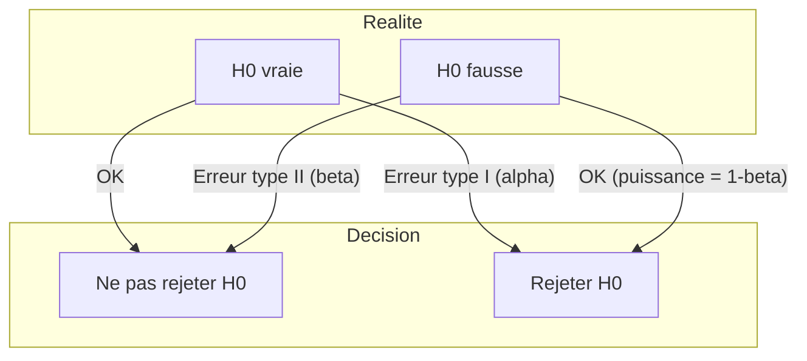
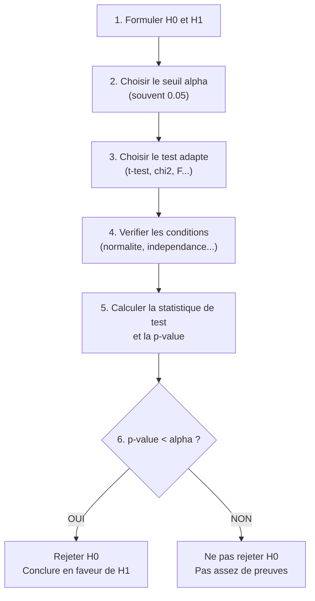

# Chapitre 03 -- Tests d'hypothese

> **Idee centrale :** Decider si une difference observee est **reelle** ou simplement due au **hasard**.

**Prerequis :** [Estimation statistique](/S6/Statistiques_Descriptives/guide/02-statistical-estimation)

---

## 1. Analogie : le tribunal

Un test d'hypothese fonctionne exactement comme un tribunal :

| Tribunal | Statistiques |
|----------|-------------|
| L'accuse est **presume innocent** | $H_0$ (hypothese nulle) est **presumee vraie** |
| Le procureur cherche des **preuves** | On calcule une **statistique de test** |
| Si les preuves sont **accablantes** | Si la p-value est **petite** |
| On declare l'accuse **coupable** | On **rejette** $H_0$ |
| Sinon, on le declare **non coupable** | On **ne rejette pas** $H_0$ |
| "Non coupable" $\neq$ "innocent" | "Non rejet de $H_0$" $\neq$ "$H_0$ est vraie" |

---

## 2. Les hypotheses $H_0$ et $H_1$

### 2.1 Formulation

| Hypothese | Nom | Role |
|-----------|-----|------|
| $H_0$ | Hypothese nulle | Le statu quo : "il ne se passe rien", "pas de difference", "pas d'effet" |
| $H_1$ | Hypothese alternative | Ce qu'on veut montrer : "il y a une difference", "il y a un effet" |

### 2.2 Types de tests

| Type | $H_0$ | $H_1$ | Utilisation |
|------|--------|--------|------------|
| **Bilateral** | $\mu = \mu_0$ | $\mu \neq \mu_0$ | On cherche une difference (sans savoir le sens) |
| **Unilateral a droite** | $\mu \leq \mu_0$ | $\mu > \mu_0$ | On cherche une augmentation |
| **Unilateral a gauche** | $\mu \geq \mu_0$ | $\mu < \mu_0$ | On cherche une diminution |

---

## 3. Les erreurs



| | $H_0$ vraie | $H_0$ fausse |
|---|-------------|-------------|
| **Ne pas rejeter $H_0$** | Bonne decision | Erreur de type II ($\beta$) |
| **Rejeter $H_0$** | Erreur de type I ($\alpha$) | Bonne decision (puissance $1-\beta$) |

### 3.1 Erreur de type I ($\alpha$)

**Rejeter $H_0$ alors qu'elle est vraie.** C'est le "faux positif".

- Le **niveau de signification** $\alpha$ est la probabilite maximale d'erreur de type I qu'on accepte.
- En pratique, on fixe souvent $\alpha = 0.05$ (5%).

### 3.2 Erreur de type II ($\beta$)

**Ne pas rejeter $H_0$ alors qu'elle est fausse.** C'est le "faux negatif".

### 3.3 Puissance ($1 - \beta$)

La **puissance** est la probabilite de rejeter $H_0$ quand elle est effectivement fausse. C'est la capacite du test a detecter un vrai effet.

La puissance augmente quand :
- La taille d'echantillon $n$ augmente.
- L'effet reel est plus grand.
- Le niveau $\alpha$ augmente (mais on accepte plus de faux positifs).
- La variance $\sigma^2$ diminue.

---

## 4. La p-value

### 4.1 Definition

La **p-value** est la probabilite d'observer un resultat **au moins aussi extreme** que celui observe, **en supposant que $H_0$ est vraie**.

### 4.2 Interpretation

| p-value | Interpretation | Decision (au seuil $\alpha = 0.05$) |
|---------|---------------|--------------------------------------|
| $p < 0.001$ | Evidence tres forte contre $H_0$ | Rejet |
| $0.001 \leq p < 0.01$ | Evidence forte | Rejet |
| $0.01 \leq p < 0.05$ | Evidence moderee | Rejet |
| $0.05 \leq p < 0.10$ | Evidence faible ("tendance") | Non rejet |
| $p \geq 0.10$ | Pas d'evidence | Non rejet |

### 4.3 La regle de decision

$$\boxed{\text{Si } p\text{-value} < \alpha \text{, on rejette } H_0}$$

C'est **la** regle fondamentale.

### 4.4 Ce que la p-value n'est PAS

- La p-value n'est **pas** la probabilite que $H_0$ soit vraie.
- La p-value n'est **pas** la probabilite que le resultat soit du au hasard.
- La p-value n'est **pas** une mesure de la taille de l'effet.

---

## 5. Demarche generale d'un test



---

## 6. Region critique et statistique de test

### 6.1 Statistique de test

C'est une quantite calculee a partir des donnees qui mesure "a quel point les donnees sont incompatibles avec $H_0$". Sa forme generale :

$$T = \frac{\text{estimateur} - \text{valeur sous } H_0}{\text{erreur standard de l'estimateur}}$$

### 6.2 Region critique

La **region critique** (ou region de rejet) est l'ensemble des valeurs de la statistique de test pour lesquelles on rejette $H_0$.

| Type de test | Region critique (seuil $\alpha$) |
|-------------|----------------------------------|
| Bilateral | $|T| > t_{n-1, 1-\alpha/2}$ |
| Unilateral droit | $T > t_{n-1, 1-\alpha}$ |
| Unilateral gauche | $T < -t_{n-1, 1-\alpha}$ |

---

## 7. Verification des hypotheses du test

Avant d'appliquer un test, il faut verifier ses conditions d'application :

### 7.1 Test de normalite : Shapiro-Wilk

$$H_0 : \text{les donnees suivent une loi normale} \quad vs \quad H_1 : \text{non}$$

```r
shapiro.test(donnees)
# Si p > 0.05 : normalite OK
# Si p < 0.05 : normalite rejetee
```

### 7.2 QQ-plot

Le graphique quantile-quantile compare les quantiles observes aux quantiles theoriques de la loi normale. Si les points sont alignes sur la diagonale, la normalite est plausible.

```r
qqnorm(donnees)
qqline(donnees, col = "red")
```

### 7.3 Test d'egalite des variances : Bartlett / Fisher

Pour comparer deux variances :

$$H_0 : \sigma_1^2 = \sigma_2^2 \quad vs \quad H_1 : \sigma_1^2 \neq \sigma_2^2$$

```r
# Test F (deux echantillons)
var.test(x, y)

# Test de Bartlett (plusieurs groupes)
bartlett.test(valeur ~ groupe, data = df)
```

---

## 8. Pieges classiques

### Piege 1 : Confondre "non significatif" et "pas d'effet"

Un resultat non significatif ($p \geq 0.05$) signifie qu'on n'a pas assez de preuves pour rejeter $H_0$. Ca ne prouve **pas** que $H_0$ est vraie. Avec un echantillon plus grand, on pourrait peut-etre detecter l'effet.

### Piege 2 : Confondre significativite statistique et importance pratique

Un effet peut etre **statistiquement significatif** (p < 0.05) mais **pratiquement negligeable**. Avec un echantillon assez grand, meme une difference infime devient significative.

### Piege 3 : Tests multiples et inflation du risque alpha

Si on fait 20 tests a $\alpha = 0.05$, on s'attend a trouver 1 faux positif par hasard ! C'est le probleme des comparaisons multiples. Solutions :
- Correction de **Bonferroni** : diviser $\alpha$ par le nombre de tests.
- Correction de **Holm** : moins conservatrice que Bonferroni.
- **Tukey HSD** : specifique a l'ANOVA.

### Piege 4 : Test unilateral vs bilateral

Un test unilateral est plus puissant (plus facile de rejeter $H_0$), mais il faut le justifier **avant** de voir les donnees. Choisir le sens apres avoir vu les donnees est du "p-hacking".

### Piege 5 : Oublier de verifier les conditions

Un t-test suppose la normalite (ou $n$ grand). Un test de chi-deux suppose des effectifs suffisants. Ignorer ces conditions peut invalider les resultats.

---

## CHEAT SHEET

### Demarche en 6 etapes

1. Formuler $H_0$ et $H_1$
2. Fixer $\alpha$ (en general 0.05)
3. Choisir le test (voir chapitre 04)
4. Verifier les conditions (normalite, independance, etc.)
5. Calculer la statistique de test et la p-value
6. Conclure : si $p < \alpha$, rejeter $H_0$

### Tableau de decision

| | $H_0$ vraie | $H_0$ fausse |
|---|-------------|-------------|
| Ne pas rejeter | OK | Erreur II ($\beta$) |
| Rejeter | Erreur I ($\alpha$) | OK (puissance $1-\beta$) |

### Mots cles pour la conclusion

| Si... | Rediger : |
|-------|----------|
| $p < \alpha$ | "On rejette $H_0$ au risque $\alpha$. Au risque de 5%, la difference est significative." |
| $p \geq \alpha$ | "On ne rejette pas $H_0$ au risque $\alpha$. On ne peut pas conclure a une difference significative." |

### Fonctions R

| Fonction | Usage |
|----------|-------|
| `shapiro.test(x)` | Test de normalite |
| `var.test(x, y)` | Test d'egalite des variances (F) |
| `bartlett.test(y ~ g)` | Test de Bartlett (variances, $k$ groupes) |
| `qqnorm(x); qqline(x)` | QQ-plot |
| `p.adjust(p, method = "bonferroni")` | Correction pour tests multiples |
