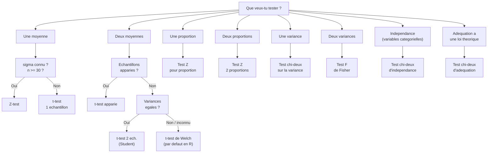

# Chapitre 04 -- Tests courants

> **Idee centrale :** Un catalogue de tous les tests statistiques du cours, avec pour chacun : quand l'utiliser, la formule, le code R, et un exemple.

**Prerequis :** [Tests d'hypothese](/S6/Statistiques_Descriptives/guide/03-hypothesis-testing)

---

## 1. Vue d'ensemble : quel test choisir ?



---

## 2. Test Z (une moyenne, $\sigma$ connu ou $n$ grand)

### Quand l'utiliser ?

- Tester si $\mu = \mu_0$.
- $\sigma$ connu OU $n \geq 30$ (TCL).

### Formule

$$Z = \frac{\bar{X} - \mu_0}{\sigma / \sqrt{n}} \sim \mathcal{N}(0, 1) \text{ sous } H_0$$

Si $\sigma$ est inconnu mais $n$ grand, on remplace par $S$.

### Exemple en R

```r
# Donnees
x <- c(52, 48, 51, 49, 50, 53, 47, 52, 50, 51)
mu0 <- 50
sigma <- 2  # suppose connu

z <- (mean(x) - mu0) / (sigma / sqrt(length(x)))
p_value <- 2 * (1 - pnorm(abs(z)))  # bilateral

cat("Z =", z, "\n")
cat("p-value =", p_value, "\n")
```

---

## 3. t-test pour un echantillon

### Quand l'utiliser ?

- Tester si $\mu = \mu_0$.
- $\sigma$ inconnu, $n$ petit.
- Donnees normales (ou $n \geq 30$).

### Formule

$$T = \frac{\bar{X} - \mu_0}{S / \sqrt{n}} \sim t_{n-1} \text{ sous } H_0$$

### Code R

```r
# H0 : mu = 50   vs   H1 : mu != 50
x <- c(52, 48, 51, 49, 50, 53, 47, 52, 50, 51)
t.test(x, mu = 50)

# Unilateral a droite : H1 : mu > 50
t.test(x, mu = 50, alternative = "greater")

# Unilateral a gauche : H1 : mu < 50
t.test(x, mu = 50, alternative = "less")
```

### Exemple detaille

**Enonce :** Un fabricant affirme que ses vis mesurent en moyenne 10 mm. On mesure 12 vis : {10.1, 9.8, 10.3, 10.0, 9.9, 10.2, 10.1, 9.7, 10.4, 10.0, 10.1, 9.9}.

```r
vis <- c(10.1, 9.8, 10.3, 10.0, 9.9, 10.2, 10.1, 9.7, 10.4, 10.0, 10.1, 9.9)

# H0 : mu = 10  vs  H1 : mu != 10
result <- t.test(vis, mu = 10)
print(result)
# t = 1.26, df = 11, p-value = 0.23
# p > 0.05 → on ne rejette pas H0
# Conclusion : pas de preuve que la moyenne differe de 10 mm

# Verification de la normalite
shapiro.test(vis)  # p = 0.96 → normalite OK
```

---

## 4. t-test pour deux echantillons independants

### Quand l'utiliser ?

- Comparer les moyennes de **deux groupes independants**.
- Donnees normales (ou $n$ grand dans chaque groupe).

### 4.1 Test de Student (variances egales)

$$T = \frac{\bar{X}_1 - \bar{X}_2}{S_p \sqrt{\frac{1}{n_1} + \frac{1}{n_2}}} \sim t_{n_1 + n_2 - 2}$$

avec $S_p^2 = \frac{(n_1-1)S_1^2 + (n_2-1)S_2^2}{n_1 + n_2 - 2}$ (variance poolee).

### 4.2 Test de Welch (variances inegales) -- defaut en R

$$T = \frac{\bar{X}_1 - \bar{X}_2}{\sqrt{\frac{S_1^2}{n_1} + \frac{S_2^2}{n_2}}} \sim t_\nu$$

avec $\nu$ (degres de liberte de Welch-Satterthwaite) :

$$\nu = \frac{\left(\frac{S_1^2}{n_1} + \frac{S_2^2}{n_2}\right)^2}{\frac{(S_1^2/n_1)^2}{n_1-1} + \frac{(S_2^2/n_2)^2}{n_2-1}}$$

### Code R

```r
# Deux groupes
groupe_A <- c(12.1, 11.8, 12.5, 11.9, 12.3, 12.0)
groupe_B <- c(11.5, 11.2, 11.8, 11.6, 11.4, 11.7)

# Test de Welch (defaut, pas besoin de supposer variances egales)
t.test(groupe_A, groupe_B)

# Test de Student (si variances egales verifiees)
t.test(groupe_A, groupe_B, var.equal = TRUE)

# Avant : verifier l'egalite des variances avec le test F
var.test(groupe_A, groupe_B)
# Si p > 0.05 → variances considerees egales
```

### Exemple : comparaison de disques durs

**Enonce (TD) :** On compare la duree de vie (en heures) de deux marques de disques durs.

```r
marque_A <- c(1525, 1540, 1510, 1530, 1538, 1527, 1545, 1533)
marque_B <- c(1480, 1512, 1500, 1495, 1508, 1502, 1510, 1498)

# H0 : mu_A = mu_B   vs   H1 : mu_A != mu_B
# 1) Verifier normalite
shapiro.test(marque_A)  # p > 0.05 → OK
shapiro.test(marque_B)  # p > 0.05 → OK

# 2) Verifier egalite des variances
var.test(marque_A, marque_B)
# Si p > 0.05 : variances egales → var.equal = TRUE

# 3) Test t
t.test(marque_A, marque_B, var.equal = TRUE)
# Conclusion : si p < 0.05, les durees de vie different significativement
```

---

## 5. t-test apparie (paired)

### Quand l'utiliser ?

- Comparer les **memes sujets** dans deux conditions (avant/apres, traitement A vs B sur le meme patient).
- On analyse les **differences** $d_i = x_{i,1} - x_{i,2}$.

### Formule

$$T = \frac{\bar{d}}{S_d / \sqrt{n}} \sim t_{n-1}$$

ou $\bar{d}$ est la moyenne des differences et $S_d$ leur ecart-type.

### Code R

```r
avant <- c(120, 135, 128, 140, 125, 132)
apres <- c(115, 130, 122, 135, 118, 128)

# H0 : mu_d = 0 (pas de difference)
t.test(avant, apres, paired = TRUE)

# Equivalent a :
differences <- avant - apres
t.test(differences, mu = 0)
```

---

## 6. Test chi-deux d'independance

### Quand l'utiliser ?

- Tester si deux variables **categorielles** sont independantes.
- Donnees sous forme de **tableau de contingence**.

### Formule

$$\chi^2 = \sum_{i,j} \frac{(O_{ij} - E_{ij})^2}{E_{ij}}$$

ou $O_{ij}$ sont les effectifs observes et $E_{ij} = \frac{n_{i\cdot} \cdot n_{\cdot j}}{n}$ les effectifs theoriques sous $H_0$ (independance).

Sous $H_0$ : $\chi^2 \sim \chi^2_{(r-1)(c-1)}$ avec $r$ lignes et $c$ colonnes.

### Condition

Tous les effectifs theoriques doivent etre $\geq 5$.

### Code R

```r
# Tableau de contingence
tableau <- matrix(c(30, 10, 20, 40), nrow = 2,
                  dimnames = list(Sexe = c("H", "F"),
                                  Preference = c("A", "B")))
print(tableau)

# H0 : Sexe et Preference sont independants
chisq.test(tableau)
# Si p < 0.05 → dependance significative

# Verifier les effectifs theoriques
chisq.test(tableau)$expected
```

---

## 7. Test chi-deux d'adequation (goodness-of-fit)

### Quand l'utiliser ?

- Tester si les donnees suivent une **loi theorique** donnee.

### Formule

$$\chi^2 = \sum_{i=1}^{k} \frac{(O_i - E_i)^2}{E_i} \sim \chi^2_{k-1-p}$$

ou $k$ est le nombre de categories, $p$ le nombre de parametres estimes.

### Code R

```r
# Exemple : un de est-il equilibre ?
# On a lance 120 fois : 25, 17, 15, 23, 24, 16 pour les faces 1-6
observe <- c(25, 17, 15, 23, 24, 16)
attendu <- rep(120/6, 6)  # 20 pour chaque face

chisq.test(observe, p = rep(1/6, 6))
# Si p > 0.05 → le de semble equilibre

# Exemple : adequation a une loi de Poisson
# H0 : les donnees suivent une loi de Poisson
chisq.test(observe, p = dpois(0:5, lambda = 2))
```

---

## 8. Test F de Fisher (comparaison de variances)

### Quand l'utiliser ?

- Comparer les variances de **deux populations** normales.
- Souvent utilise comme prerequis pour le t-test (verifier l'egalite des variances).

### Formule

$$F = \frac{S_1^2}{S_2^2} \sim F_{n_1-1, n_2-1} \text{ sous } H_0 : \sigma_1^2 = \sigma_2^2$$

### Code R

```r
# H0 : sigma1^2 = sigma2^2
var.test(groupe_A, groupe_B)
# Si p > 0.05 → variances considerees egales
```

---

## 9. Test sur une variance ($\chi^2$)

### Quand l'utiliser ?

- Tester si $\sigma^2 = \sigma_0^2$ pour une population normale.

### Formule

$$\chi^2 = \frac{(n-1) S^2}{\sigma_0^2} \sim \chi^2_{n-1} \text{ sous } H_0$$

### Code R

```r
# H0 : sigma^2 = 4   vs   H1 : sigma^2 != 4
x <- c(12.1, 11.8, 12.5, 11.9, 12.3, 12.0)
sigma0_sq <- 4
n <- length(x)
s_sq <- var(x)

chi2 <- (n - 1) * s_sq / sigma0_sq
p_val <- 2 * min(pchisq(chi2, df = n-1), 1 - pchisq(chi2, df = n-1))

cat("chi2 =", chi2, "| p-value =", p_val, "\n")
```

---

## 10. Test de proportion (Z-test)

### 10.1 Une proportion

$$Z = \frac{\hat{p} - p_0}{\sqrt{\frac{p_0(1-p_0)}{n}}} \sim \mathcal{N}(0,1)$$

```r
# H0 : p = 0.5  vs  H1 : p != 0.5
# 68 succes sur 200
prop.test(68, 200, p = 0.5)
```

### 10.2 Deux proportions

$$Z = \frac{\hat{p}_1 - \hat{p}_2}{\sqrt{\hat{p}(1-\hat{p})\left(\frac{1}{n_1}+\frac{1}{n_2}\right)}}$$

ou $\hat{p} = \frac{x_1 + x_2}{n_1 + n_2}$.

```r
# H0 : p1 = p2
prop.test(c(45, 35), c(100, 100))
```

---

## 11. Exercices types du cours

### Exercice : Test bilateral sur la moyenne (loi normale)

**Enonce (TD2) :** On considere un echantillon de taille $n = 16$ issu d'une $\mathcal{N}(\mu, 4)$. On observe $\bar{x} = 7.2$. Tester $H_0: \mu = 7$ contre $H_1: \mu \neq 7$ au seuil 5%.

**Solution :**

La variance $\sigma^2 = 4$ est connue ($\sigma = 2$).

$$Z = \frac{7.2 - 7}{2 / \sqrt{16}} = \frac{0.2}{0.5} = 0.4$$

Region de rejet bilateral : $|Z| > z_{0.975} = 1.96$.

$|0.4| = 0.4 < 1.96$ : on ne rejette pas $H_0$.

### Exercice : Test unilateral sur la moyenne

**Enonce (TD2) :** Meme situation, tester $H_0: \mu \leq 7$ contre $H_1: \mu > 7$.

**Solution :**

Region de rejet unilateral droit : $Z > z_{0.95} = 1.645$.

$0.4 < 1.645$ : on ne rejette pas $H_0$.

### Exercice : Test sur la variance

**Enonce (TD2) :** Avec les memes donnees ($n = 16$, $s^2 = 5.1$), tester $H_0: \sigma^2 = 4$ contre $H_1: \sigma^2 > 4$.

**Solution :**

$$\chi^2 = \frac{(16-1) \times 5.1}{4} = \frac{76.5}{4} = 19.125$$

Region de rejet : $\chi^2 > \chi^2_{15, 0.95} = 25.00$.

$19.125 < 25.00$ : on ne rejette pas $H_0$.

---

## 12. Pieges classiques

### Piege 1 : Utiliser le mauvais test

C'est l'erreur la plus courante en exam. Utiliser le flowchart de la section 1 pour choisir le bon test.

### Piege 2 : Oublier de verifier les conditions

- t-test : normalite des donnees (ou $n \geq 30$)
- chi-deux : effectifs theoriques $\geq 5$
- F-test : normalite des deux populations

### Piege 3 : Confondre t-test apparie et independant

- **Apparie** : memes sujets mesures deux fois (avant/apres)
- **Independant** : deux groupes differents

### Piege 4 : Oublier `var.equal` dans `t.test()`

Par defaut, R fait un test de Welch (variances inegales). Si on a verifie que les variances sont egales, ajouter `var.equal = TRUE` pour gagner en puissance.

---

## CHEAT SHEET

### Tableau recapitulatif des tests

| Situation | Test | $H_0$ | Statistique | Loi sous $H_0$ | R |
|-----------|------|--------|-------------|----------------|---|
| 1 moyenne, $\sigma$ connu | Z-test | $\mu = \mu_0$ | $Z = \frac{\bar{X}-\mu_0}{\sigma/\sqrt{n}}$ | $\mathcal{N}(0,1)$ | Manuel |
| 1 moyenne, $\sigma$ inconnu | t-test | $\mu = \mu_0$ | $T = \frac{\bar{X}-\mu_0}{S/\sqrt{n}}$ | $t_{n-1}$ | `t.test(x, mu=)` |
| 2 moyennes indep. | t-test 2 ech. | $\mu_1 = \mu_2$ | Voir section 4 | $t_\nu$ | `t.test(x, y)` |
| 2 moyennes appariees | t-test apparie | $\mu_d = 0$ | $T = \frac{\bar{d}}{S_d/\sqrt{n}}$ | $t_{n-1}$ | `t.test(x, y, paired=T)` |
| 1 proportion | Z-test | $p = p_0$ | $Z = \frac{\hat{p}-p_0}{\sqrt{p_0(1-p_0)/n}}$ | $\mathcal{N}(0,1)$ | `prop.test(x, n, p=)` |
| 2 proportions | Z-test | $p_1 = p_2$ | Voir section 10 | $\mathcal{N}(0,1)$ | `prop.test(c(), c())` |
| 1 variance | $\chi^2$ | $\sigma^2 = \sigma_0^2$ | $\chi^2 = \frac{(n-1)S^2}{\sigma_0^2}$ | $\chi^2_{n-1}$ | Manuel |
| 2 variances | F-test | $\sigma_1^2 = \sigma_2^2$ | $F = S_1^2/S_2^2$ | $F_{n_1-1,n_2-1}$ | `var.test(x, y)` |
| Independance | $\chi^2$ | Independance | $\sum\frac{(O-E)^2}{E}$ | $\chi^2_{(r-1)(c-1)}$ | `chisq.test(tab)` |
| Adequation | $\chi^2$ | Loi theorique | $\sum\frac{(O-E)^2}{E}$ | $\chi^2_{k-1-p}$ | `chisq.test(o, p=)` |
| Normalite | Shapiro-Wilk | Normalite | $W$ | Specifique | `shapiro.test(x)` |
| Egalite var. ($k$ gr.) | Bartlett | $\sigma_1^2 = \cdots = \sigma_k^2$ | $K$ | $\chi^2_{k-1}$ | `bartlett.test(y~g)` |

### Quantiles utiles ($\alpha = 0.05$)

| Loi | Quantile |
|-----|----------|
| $\mathcal{N}(0,1)$ | $z_{0.975} = 1.960$ |
| $t_5$ | $t_{5, 0.975} = 2.571$ |
| $t_{10}$ | $t_{10, 0.975} = 2.228$ |
| $t_{20}$ | $t_{20, 0.975} = 2.086$ |
| $t_{30}$ | $t_{30, 0.975} = 2.042$ |
| $\chi^2_{10}$ | $\chi^2_{10, 0.95} = 18.31$ |
| $\chi^2_{15}$ | $\chi^2_{15, 0.95} = 25.00$ |
