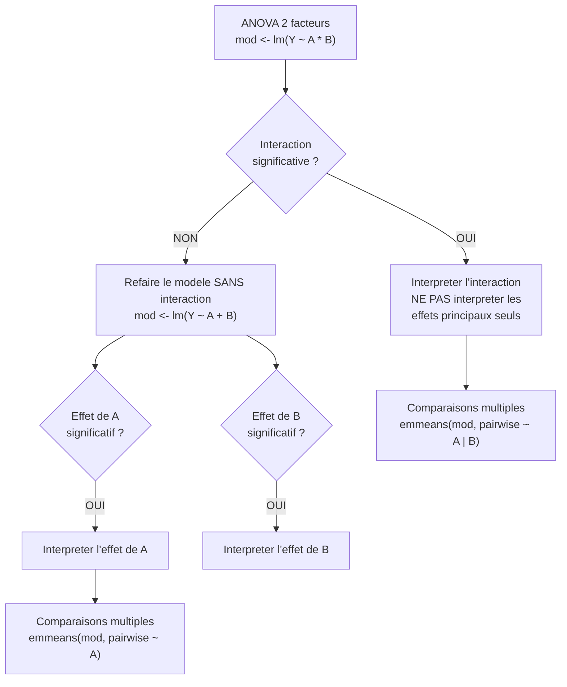

# Chapitre 06 -- ANOVA (Analyse de la Variance)

> **Idee centrale :** Comparer les moyennes de **plusieurs groupes** en decomposant la variabilite totale en variabilite inter-groupes et intra-groupes.

**Prerequis :** [Tests courants](/S6/Statistiques_Descriptives/guide/04-common-tests)

---

## PARTIE A : ANOVA a un facteur

---

## 1. Pourquoi pas des t-tests multiples ?

Si on a 3 groupes (A, B, C) et qu'on fait 3 comparaisons (A vs B, A vs C, B vs C) avec $\alpha = 0.05$ chacune, le risque global d'erreur de type I n'est plus 5% mais :

$$\alpha_{global} = 1 - (1 - 0.05)^3 \approx 14.3\%$$

Avec $k$ groupes, on a $\binom{k}{2}$ comparaisons et le risque explose. L'ANOVA resout ce probleme en faisant **un seul test global**.

---

## 2. Le modele

$$Y_{ij} = \mu + \alpha_i + \varepsilon_{ij}, \quad i = 1, \ldots, J, \quad j = 1, \ldots, n_i$$

| Terme | Signification |
|-------|--------------|
| $Y_{ij}$ | Observation $j$ du groupe $i$ |
| $\mu$ | Moyenne generale |
| $\alpha_i$ | Effet du groupe $i$ (ecart a la moyenne generale) |
| $\varepsilon_{ij}$ | Erreur, $\varepsilon_{ij} \overset{iid}{\sim} \mathcal{N}(0, \sigma^2)$ |

**Contraintes :**
- Contrainte naturelle : $\sum_{i=1}^{J} n_i \alpha_i = 0$
- Contrainte temoin (defaut R) : $\alpha_1 = 0$ (le 1er groupe sert de reference)

---

## 3. Decomposition de la variance

$$\underbrace{\sum_{i,j} (Y_{ij} - \bar{Y}_{\cdot\cdot})^2}_{SCT} = \underbrace{\sum_i n_i (\bar{Y}_{i\cdot} - \bar{Y}_{\cdot\cdot})^2}_{SCE \text{ (inter)}} + \underbrace{\sum_{i,j} (Y_{ij} - \bar{Y}_{i\cdot})^2}_{SCR \text{ (intra)}}$$

| Terme | Nom | ddl | Carre moyen |
|-------|-----|-----|-------------|
| $SCE$ | Inter-groupes | $J - 1$ | $CME = SCE / (J-1)$ |
| $SCR$ | Intra-groupes | $n - J$ | $CMR = SCR / (n-J)$ |
| $SCT$ | Totale | $n - 1$ | |

---

## 4. La statistique F

$$F = \frac{CME}{CMR} = \frac{\text{variabilite inter-groupes}}{\text{variabilite intra-groupes}} \sim F_{J-1, n-J} \text{ sous } H_0$$

**Interpretation :** F mesure le rapport signal/bruit.
- $F$ grand : les groupes different beaucoup entre eux par rapport a la variabilite interne $\Rightarrow$ on rejette $H_0$.
- $F \approx 1$ : les differences entre groupes sont du meme ordre que la variabilite interne $\Rightarrow$ pas de difference significative.

### Table d'ANOVA

| Source | ddl | Somme des carres | Carre moyen | F | p-value |
|--------|-----|-----------------|-------------|---|---------|
| Facteur | $J-1$ | $SCE$ | $CME = SCE/(J-1)$ | $CME/CMR$ | $P(F_{J-1,n-J} > F_{obs})$ |
| Residus | $n-J$ | $SCR$ | $CMR = SCR/(n-J)$ | | |
| Total | $n-1$ | $SCT$ | | | |

---

## 5. Hypotheses de l'ANOVA

1. **Independance** des observations.
2. **Normalite** des residus (dans chaque groupe).
3. **Homoscedasticite** : $\sigma_1^2 = \sigma_2^2 = \cdots = \sigma_J^2$.

### Verification

```r
# Normalite
shapiro.test(residuals(modele))

# Homoscedasticite
bartlett.test(Y ~ Groupe, data = df)
# Si p > 0.05 → variances homogenes

# Graphiques de diagnostic
par(mfrow = c(2, 2))
plot(modele)
par(mfrow = c(1, 1))
```

**Si les hypotheses sont violees :** utiliser le test non parametrique de **Kruskal-Wallis** (voir chapitre 07).

---

## 6. Comparaisons multiples (post-hoc)

Si l'ANOVA rejette $H_0$, on sait qu'au moins un groupe differe, mais **lequel** ? On utilise des tests post-hoc.

### 6.1 Tukey HSD (Honest Significant Difference)

```r
TukeyHSD(aov(Y ~ Groupe, data = df))
```

Controle le risque global a $\alpha = 0.05$ pour toutes les comparaisons deux a deux.

### 6.2 Bonferroni (avec emmeans)

```r
library(emmeans)
comp <- emmeans(modele, pairwise ~ Groupe, adjust = "bonferroni")
print(comp)
```

### 6.3 Taille d'effet ($\eta^2$)

$$\eta^2 = \frac{SCE}{SCT}$$

| $\eta^2$ | Taille d'effet |
|-----------|----------------|
| $< 0.01$ | Negligeable |
| $0.01 - 0.06$ | Petit |
| $0.06 - 0.14$ | Moyen |
| $> 0.14$ | Grand |

---

## 7. Exemple du TP4 : Hotdogs

```r
tab <- read.table("hotdogs.txt", header = TRUE)
tab <- tab[-which(tab$Type == 4), ]  # Supprimer le type aberrant
tab$Type <- as.factor(tab$Type)

# Boxplots
boxplot(Calories ~ Type, data = tab,
        col = c("red", "orange", "lightblue"),
        main = "Calories par type de hotdog")

# ANOVA
mod1 <- lm(Calories ~ Type, data = tab)
anova(mod1)
# F significatif → le type a un effet sur les calories

# Parametres estimes (contrainte temoin)
summary(mod1)
# (Intercept) = moyenne du type 1 (boeuf)
# Type2 = difference type 2 - type 1
# Type3 = difference type 3 - type 1

# Comparaisons multiples
library(emmeans)
emmeans(mod1, pairwise ~ Type, adjust = "bonferroni")
# Conclusion : le type 3 (volaille) est le moins calorique
```

---

## PARTIE B : ANOVA a deux facteurs

---

## 8. Le modele avec interaction

$$Y_{ijk} = \mu + \alpha_i + \beta_j + (\alpha\beta)_{ij} + \varepsilon_{ijk}$$

| Terme | Signification |
|-------|--------------|
| $\alpha_i$ | Effet du facteur A (niveau $i$) |
| $\beta_j$ | Effet du facteur B (niveau $j$) |
| $(\alpha\beta)_{ij}$ | Interaction entre A et B |
| $\varepsilon_{ijk}$ | Erreur |

### Interaction : qu'est-ce que c'est ?

L'interaction signifie que l'effet d'un facteur **depend du niveau** de l'autre facteur.

**Analogie du restaurant :** Tu testes 2 restaurants et 2 plats.
- Sans interaction : le restaurant A est toujours meilleur, quel que soit le plat.
- Avec interaction : le restaurant A est meilleur pour le poisson, mais le restaurant B est meilleur pour la viande. L'effet "restaurant" depend du plat.

### Graphique d'interaction

```r
interaction.plot(facteur_A, facteur_B, Y)
```

- **Lignes paralleles** = pas d'interaction.
- **Lignes croisees** = interaction forte.

---

## 9. Table ANOVA a deux facteurs

| Source | ddl | SC | CM | F |
|--------|-----|-----|-----|---|
| Facteur A | $I-1$ | $SC_A$ | $CM_A$ | $CM_A / CM_R$ |
| Facteur B | $J-1$ | $SC_B$ | $CM_B$ | $CM_B / CM_R$ |
| A:B (interaction) | $(I-1)(J-1)$ | $SC_{AB}$ | $CM_{AB}$ | $CM_{AB} / CM_R$ |
| Residus | $n - IJ$ | $SC_R$ | $CM_R$ | |
| Total | $n-1$ | $SC_T$ | | |

### Code R

```r
# Modele avec interaction
mod <- lm(Y ~ facteur_A * facteur_B, data = df)
# Equivalent a : lm(Y ~ facteur_A + facteur_B + facteur_A:facteur_B)
anova(mod)

# Modele sans interaction (additif)
mod_add <- lm(Y ~ facteur_A + facteur_B, data = df)
anova(mod_add)
```

---

## 10. Strategie d'interpretation



**Regle d'or :** Si l'interaction est significative, il est **trompeur** d'interpreter les effets principaux seuls car l'effet d'un facteur depend du niveau de l'autre.

---

## 11. Exemple du TP4 : Acidite du cafe

```r
cafe <- read.csv("cafe.csv")
cafe$cafe <- as.factor(cafe$cafe)
cafe$juge <- as.factor(cafe$juge)

# Modele sans interaction
mod_add <- lm(acidite ~ cafe + juge, data = cafe)
anova(mod_add)
# cafe significatif : le type de cafe a un effet sur l'acidite
# juge significatif : il est utile de controler l'effet juge

# Modele avec interaction
mod_inter <- lm(acidite ~ cafe * juge, data = cafe)
anova(mod_inter)
# Si interaction non significative → garder le modele additif

# Comparaisons multiples
library(emmeans)
emmeans(mod_add, pairwise ~ cafe, adjust = "bonferroni")
```

### Exemple du TP4 : Resistance textile

```r
resistance <- read.table("resistance_textile.txt", header = TRUE)
resistance$position <- as.factor(resistance$position)
resistance$cycle <- as.factor(resistance$cycle)
resistance$textile <- as.factor(resistance$textile)

# ANOVA 1 facteur (textile seul)
mod1 <- lm(perte_poids ~ textile, data = resistance)
anova(mod1)  # significatif

# ANOVA 3 facteurs
mod3 <- lm(perte_poids ~ textile + position + cycle, data = resistance)
anova(mod3)  # les 3 facteurs sont significatifs

# Comparaisons multiples
emmeans(mod3, pairwise ~ textile, adjust = "bonferroni")
# Textile A perd le moins → le plus resistant
```

---

## 12. Pieges classiques

### Piege 1 : Interpreter les effets principaux quand l'interaction est significative

Si l'interaction A:B est significative, dire "A a un effet significatif" est trompeur car l'effet de A depend de B.

### Piege 2 : Oublier de convertir en facteur

```r
# FAUX : R traite Type comme numerique
mod <- lm(Y ~ Type, data = df)

# CORRECT : convertir en facteur
df$Type <- as.factor(df$Type)
mod <- lm(Y ~ Type, data = df)
```

### Piege 3 : Confondre `*` et `+` dans la formule

- `Y ~ A + B` : effets principaux seulement (modele additif).
- `Y ~ A * B` : effets principaux + interaction (equivalent a `A + B + A:B`).

### Piege 4 : Comparer les moyennes a l'oeil

Les boxplots donnent une idee, mais seules les comparaisons multiples (Tukey, Bonferroni) permettent de conclure formellement.

### Piege 5 : Ignorer le plan experimental desequilibre

Quand les effectifs sont inegaux, l'ordre des facteurs dans `anova()` compte (ANOVA de type I sequentielle). Utiliser `Anova(mod, type = "III")` du package `car` pour les sommes de carres de type III.

---

## CHEAT SHEET

### ANOVA 1 facteur

| Formule | Expression |
|---------|-----------|
| Modele | $Y_{ij} = \mu + \alpha_i + \varepsilon_{ij}$ |
| $SCE$ (inter) | $\sum_i n_i (\bar{Y}_{i\cdot} - \bar{Y}_{\cdot\cdot})^2$ |
| $SCR$ (intra) | $\sum_{i,j} (Y_{ij} - \bar{Y}_{i\cdot})^2$ |
| $SCT$ (total) | $\sum_{i,j} (Y_{ij} - \bar{Y}_{\cdot\cdot})^2$ |
| $F$ | $CME / CMR = \frac{SCE/(J-1)}{SCR/(n-J)}$ |
| $\eta^2$ | $SCE / SCT$ |

### ANOVA 2 facteurs

| Element | Formule R |
|---------|-----------|
| Avec interaction | `lm(Y ~ A * B)` |
| Sans interaction | `lm(Y ~ A + B)` |
| Table ANOVA | `anova(mod)` |
| Type III SS | `car::Anova(mod, type = "III")` |

### Fonctions R

| Fonction | Usage |
|----------|-------|
| `lm(Y ~ Groupe)` | Modele ANOVA (via lm) |
| `aov(Y ~ Groupe)` | Modele ANOVA (via aov) |
| `anova(mod)` | Table ANOVA |
| `summary(mod)` | Coefficients et tests |
| `TukeyHSD(aov(...))` | Comparaisons Tukey |
| `emmeans(mod, pairwise ~ G)` | Comparaisons avec emmeans |
| `bartlett.test(Y ~ G)` | Test d'homoscedasticite |
| `interaction.plot(A, B, Y)` | Graphe d'interaction |
| `as.factor(x)` | Convertir en facteur |
| `contrasts(f)` | Voir les contrastes |

### Decision rapide

1. Convertir les groupes en **facteur** (`as.factor`)
2. **Boxplot** pour visualiser
3. **ANOVA** : `anova(lm(Y ~ Groupe))`
4. Si $p < 0.05$ : **post-hoc** avec `TukeyHSD()` ou `emmeans()`
5. Verifier normalite (`shapiro.test`) et homoscedasticite (`bartlett.test`)
