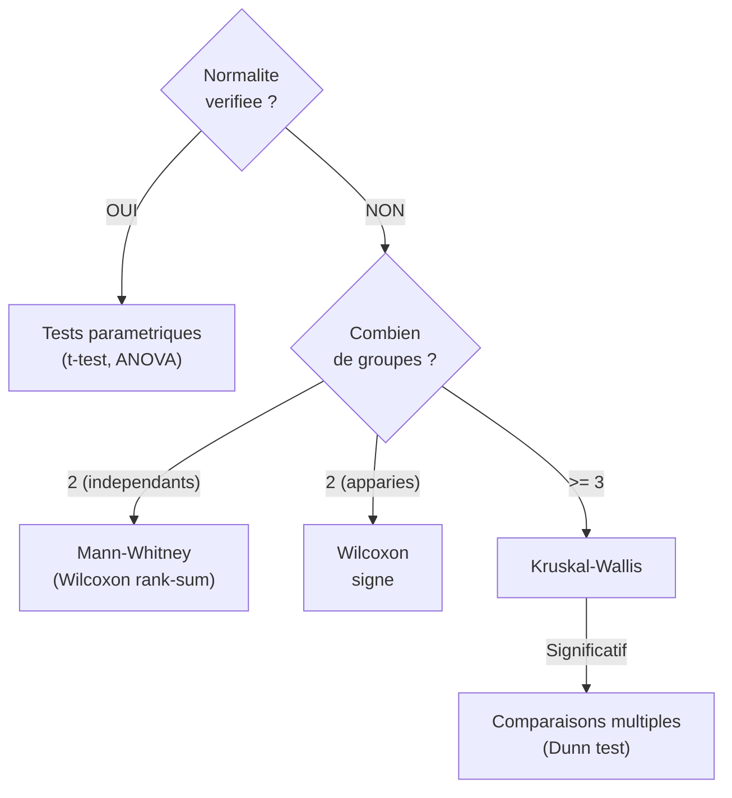

# Chapitre 07 -- Tests non parametriques

> **Idee centrale :** Quand les hypotheses des tests parametriques (normalite, homoscedasticite) ne sont pas verifiees, les tests non parametriques sont l'alternative.

**Prerequis :** [ANOVA](/S6/Statistiques_Descriptives/guide/06-anova)

---

## 1. Pourquoi des tests non parametriques ?

Les tests parametriques (t-test, ANOVA) supposent que les donnees suivent une loi normale. Quand ce n'est pas le cas :

- Petit echantillon ($n < 30$) et distribution tres asymetrique.
- Donnees ordinales (rangs, scores subjectifs).
- Valeurs aberrantes impossibles a supprimer.

Les tests non parametriques travaillent sur les **rangs** des observations plutot que sur les valeurs brutes. Ils sont **plus robustes** mais **moins puissants** (moins capables de detecter un vrai effet).



---

## 2. Test de Wilcoxon pour echantillon unique / signe

### Quand l'utiliser ?

- Alternative au t-test pour un echantillon quand la normalite n'est pas verifiee.
- Ou pour des donnees appariees (test de Wilcoxon signe).

### Principe

1. Calculer les differences $d_i = x_i - m_0$ (ou $d_i = x_{i,1} - x_{i,2}$ pour le cas apparie).
2. Classer les $|d_i|$ par rang croissant.
3. Sommer les rangs des differences positives ($W^+$) et negatives ($W^-$).
4. Comparer $W$ a la distribution tabulee.

### Hypotheses

$$H_0 : \text{mediane} = m_0 \quad vs \quad H_1 : \text{mediane} \neq m_0$$

### Code R

```r
# Test de Wilcoxon signe (un echantillon)
x <- c(12.1, 11.8, 12.5, 11.9, 12.3, 12.0, 12.4, 11.7)
wilcox.test(x, mu = 12)

# Test de Wilcoxon signe (donnees appariees)
avant <- c(120, 135, 128, 140, 125, 132)
apres <- c(115, 130, 122, 135, 118, 128)
wilcox.test(avant, apres, paired = TRUE)
```

---

## 3. Test de Mann-Whitney (Wilcoxon rank-sum)

### Quand l'utiliser ?

- Comparer deux groupes **independants**.
- Alternative au t-test pour 2 echantillons independants.
- Normalite non verifiee.

### Principe

1. Fusionner les deux echantillons et ranger toutes les observations.
2. Sommer les rangs de chaque groupe.
3. Si les distributions sont identiques, les rangs doivent etre melanges aleatoirement.

### Hypotheses

$$H_0 : \text{les deux distributions sont identiques} \quad vs \quad H_1 : \text{elles different}$$

### Formule

$$U_1 = n_1 n_2 + \frac{n_1(n_1+1)}{2} - R_1$$

ou $R_1$ est la somme des rangs du groupe 1.

### Code R

```r
# Deux groupes independants
groupe_A <- c(12.1, 11.8, 12.5, 11.9, 12.3, 12.0)
groupe_B <- c(11.5, 11.2, 11.8, 11.6, 11.4, 11.7)

wilcox.test(groupe_A, groupe_B)
# Si p < 0.05 → les distributions different significativement
```

---

## 4. Test de Kruskal-Wallis

### Quand l'utiliser ?

- Comparer **trois groupes ou plus** independants.
- Alternative a l'ANOVA a un facteur.
- Normalite non verifiee dans au moins un groupe.

### Principe

1. Ranger toutes les observations (tous groupes confondus).
2. Calculer la somme des rangs par groupe.
3. Si les groupes ont la meme distribution, les rangs moyens doivent etre proches.

### Formule

$$H = \frac{12}{n(n+1)} \sum_{i=1}^{k} \frac{R_i^2}{n_i} - 3(n+1) \sim \chi^2_{k-1} \text{ sous } H_0$$

ou $R_i$ est la somme des rangs du groupe $i$, $n_i$ l'effectif du groupe $i$, $n$ le total.

### Code R

```r
# Trois groupes ou plus
kruskal.test(Y ~ Groupe, data = df)
# Si p < 0.05 → au moins un groupe differe

# Exemple avec les hotdogs
kruskal.test(Calories ~ Type, data = hotdogs)
```

### Comparaisons multiples apres Kruskal-Wallis

Si le test est significatif, on fait des comparaisons deux a deux :

```r
# Methode 1 : tests de Wilcoxon avec correction de Bonferroni
pairwise.wilcox.test(df$Y, df$Groupe, p.adjust.method = "bonferroni")

# Methode 2 : test de Dunn (package dunn.test)
# install.packages("dunn.test")
library(dunn.test)
dunn.test(df$Y, df$Groupe, method = "bonferroni")
```

---

## 5. Tableau de correspondance parametrique / non parametrique

| Situation | Test parametrique | Test non parametrique |
|-----------|------------------|----------------------|
| 1 echantillon, position | t-test (`t.test(x, mu=)`) | Wilcoxon signe (`wilcox.test(x, mu=)`) |
| 2 echantillons apparies | t-test apparie (`t.test(x, y, paired=T)`) | Wilcoxon signe (`wilcox.test(x, y, paired=T)`) |
| 2 echantillons independants | t-test (`t.test(x, y)`) | Mann-Whitney (`wilcox.test(x, y)`) |
| $k$ echantillons independants | ANOVA (`anova(lm(Y ~ G))`) | Kruskal-Wallis (`kruskal.test(Y ~ G)`) |
| Post-hoc (2 a 2) | Tukey HSD | Dunn / Wilcoxon pairwise |

---

## 6. Exemple complet

```r
# ── Donnees : 3 traitements ────────────────────────────────
traitement_A <- c(23, 25, 27, 22, 26, 24)
traitement_B <- c(30, 32, 28, 35, 31, 29)
traitement_C <- c(20, 19, 21, 22, 18, 20)

donnees <- data.frame(
  valeur = c(traitement_A, traitement_B, traitement_C),
  groupe = factor(rep(c("A", "B", "C"), each = 6))
)

# ── Etape 1 : Verifier la normalite ───────────────────────
shapiro.test(traitement_A)  # p > 0.05 → OK
shapiro.test(traitement_B)  # p > 0.05 → OK
shapiro.test(traitement_C)  # p > 0.05 → OK
# Si un des tests echoue → utiliser Kruskal-Wallis

# ── Etape 2 : Verifier l'homoscedasticite ─────────────────
bartlett.test(valeur ~ groupe, data = donnees)
# Si p > 0.05 → ANOVA OK
# Si p < 0.05 → Kruskal-Wallis

# ── Etape 3a : ANOVA (si conditions respectees) ───────────
mod <- lm(valeur ~ groupe, data = donnees)
anova(mod)

# ── Etape 3b : Kruskal-Wallis (si conditions non respectees)
kruskal.test(valeur ~ groupe, data = donnees)

# ── Etape 4 : Comparaisons post-hoc ──────────────────────
# Apres ANOVA :
TukeyHSD(aov(valeur ~ groupe, data = donnees))

# Apres Kruskal-Wallis :
pairwise.wilcox.test(donnees$valeur, donnees$groupe,
                     p.adjust.method = "bonferroni")
```

---

## 7. Pieges classiques

### Piege 1 : Utiliser un test non parametrique quand les conditions parametriques sont remplies

Les tests non parametriques sont **moins puissants**. Si les donnees sont normales, le t-test ou l'ANOVA sont preferable car ils ont plus de chances de detecter un vrai effet.

### Piege 2 : Interpreter le Kruskal-Wallis comme un test sur les moyennes

Le Kruskal-Wallis teste si les **distributions** sont identiques, pas uniquement si les **moyennes** sont egales. Une difference dans la forme ou la dispersion peut aussi rendre le test significatif.

### Piege 3 : Oublier les comparaisons post-hoc

Comme pour l'ANOVA, un test de Kruskal-Wallis significatif ne dit pas **quels** groupes different. Il faut faire des comparaisons deux a deux avec correction.

### Piege 4 : Confondre `wilcox.test` apparie et independant

```r
# Apparie (memes sujets, deux conditions)
wilcox.test(avant, apres, paired = TRUE)

# Independant (deux groupes differents)
wilcox.test(groupe_A, groupe_B, paired = FALSE)  # defaut
```

---

## CHEAT SHEET

### Arbre de decision

```
Donnees normales ?
├── OUI → Combien de groupes ?
│   ├── 1 → t-test 1 echantillon
│   ├── 2 apparies → t-test apparie
│   ├── 2 independants → t-test 2 echantillons
│   └── >= 3 → ANOVA
└── NON → Combien de groupes ?
    ├── 1 → Wilcoxon signe
    ├── 2 apparies → Wilcoxon signe (paired)
    ├── 2 independants → Mann-Whitney
    └── >= 3 → Kruskal-Wallis
```

### Fonctions R

| Test | Parametrique | Non parametrique |
|------|-------------|-----------------|
| 1 echantillon | `t.test(x, mu=)` | `wilcox.test(x, mu=)` |
| 2 apparies | `t.test(x, y, paired=T)` | `wilcox.test(x, y, paired=T)` |
| 2 independants | `t.test(x, y)` | `wilcox.test(x, y)` |
| $k$ groupes | `anova(lm(Y ~ G))` | `kruskal.test(Y ~ G)` |
| Post-hoc | `TukeyHSD()` | `pairwise.wilcox.test()` |

### Quand choisir quoi ?

| Critere | Parametrique | Non parametrique |
|---------|-------------|-----------------|
| Hypotheses | Normalite + homoscedasticite | Aucune |
| Puissance | Plus eleve | Plus faible |
| Sensibilite aux outliers | Elevee | Faible |
| Type de donnees | Quantitatives continues | Ordinales ou non normales |
