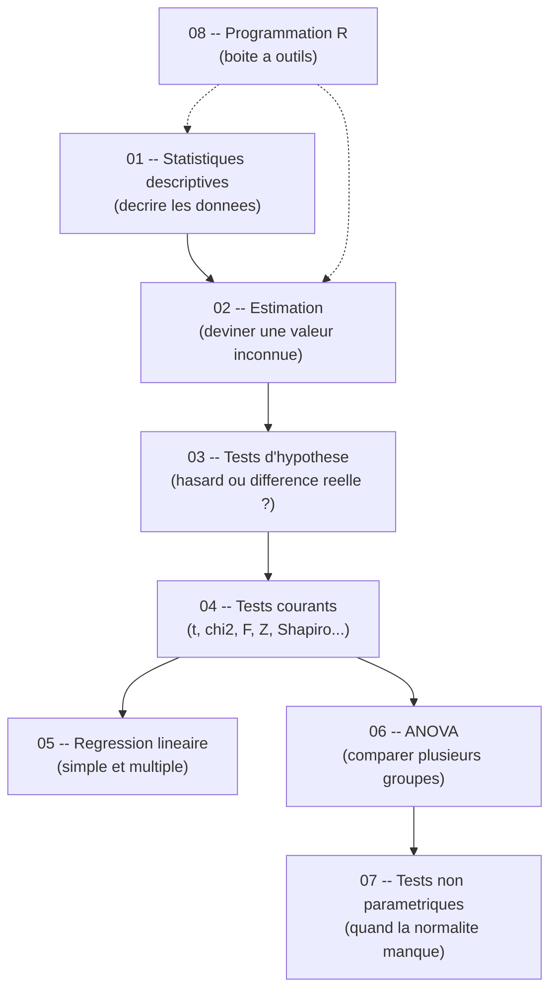

# Guide -- Statistiques Descriptives (S6, INSA Rennes 3A)

Bienvenue dans ce guide complet de statistiques (inferentielles et descriptives) pour le cours de 3eme annee a l'INSA Rennes. Il est concu pour etre accessible meme sans base solide en mathematiques. Chaque chapitre est **autonome** -- tu peux les lire dans l'ordre ou sauter directement a celui qui t'interesse.

---

## Roadmap d'apprentissage

> **Lecture du diagramme :** les fleches pleines indiquent l'ordre logique. La regression (05) et l'ANOVA (06) forment deux branches qui partent toutes les deux des tests courants (04). Le chapitre R (08) est un support transversal.

---

## Prerequis

- **Savoir ce qu'est une moyenne** -- additionner des valeurs et diviser par leur nombre.
- **Avoir R installe** -- <https://cran.r-project.org/>
- **Avoir RStudio installe** -- <https://posit.co/downloads/>

---

## Table des matieres

| # | Chapitre | Description |
|---|----------|-------------|
| 01 | [Statistiques descriptives](/S6/Statistiques_Descriptives/guide/01-descriptive-statistics) | Moyenne, mediane, variance, ecart-type, quartiles, boxplots -- decrire les donnees. |
| 02 | [Estimation statistique](/S6/Statistiques_Descriptives/guide/02-statistical-estimation) | Estimer une valeur inconnue a partir d'un echantillon -- IC, MLE, methode des moments. |
| 03 | [Tests d'hypothese](/S6/Statistiques_Descriptives/guide/03-hypothesis-testing) | H0/H1, p-value, erreurs de type I/II, puissance d'un test. |
| 04 | [Tests courants](/S6/Statistiques_Descriptives/guide/04-common-tests) | t-test, chi-deux, F-test, Z-test, tests apparies -- le catalogue. |
| 05 | [Regression lineaire](/S6/Statistiques_Descriptives/guide/05-linear-regression) | Regression simple et multiple, R2, residus, selection de variables. |
| 06 | [ANOVA](/S6/Statistiques_Descriptives/guide/06-anova) | ANOVA a 1 et 2 facteurs, F-statistic, Tukey HSD, hypotheses. |
| 07 | [Tests non parametriques](/S6/Statistiques_Descriptives/guide/07-nonparametric-tests) | Wilcoxon, Mann-Whitney, Kruskal-Wallis -- quand la normalite manque. |
| 08 | [Programmation R](/S6/Statistiques_Descriptives/guide/08-r-programming) | Data frames, import, graphiques, distributions, fonctions statistiques. |

---

## Structure d'un chapitre

Chaque chapitre suit la meme progression :

| Etape | Ce que tu y trouves |
|-------|---------------------|
| **Analogie** | Une situation de la vie courante pour ancrer le concept. |
| **Intuition visuelle** | Un schema Mermaid pour visualiser l'idee avant toute formule. |
| **Explication progressive** | Le concept explique du plus simple au plus precis. |
| **Formules** | Les equations en LaTeX, introduites quand l'intuition est en place. |
| **Exemple concret** | Un jeu de donnees realiste avec calculs detailles. |
| **Code R** | Le code complet et commente a reproduire dans RStudio. |
| **Pieges classiques** | Les erreurs frequentes et comment les eviter. |
| **CHEAT SHEET** | Un recapitulatif condense pour reviser rapidement avant un exam. |
